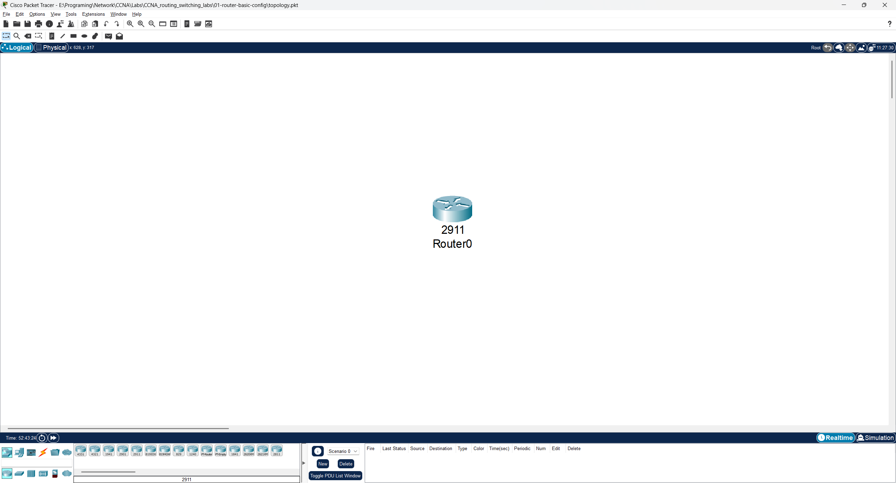

# 🖥️ CCNA Lab 01: Router Basic Configuration

## 📌 Objective

The purpose of this lab is to perform **basic router configuration** on a Cisco 2911 router using Cisco Packet Tracer.
We will cover:

* Accessing different command-line modes
* Setting the router hostname
* Securing privileged EXEC mode with a password
* Saving and verifying configurations

---

## 🗂️ Topology

The lab consists of a **single router**:



---

## ▶️ Run the Lab

You can open and run the lab directly in **Cisco Packet Tracer**:

* File: [`topology.pkt`](./topology.pkt)
* Software required: **Cisco Packet Tracer (v8.x or later)**

---

## ⚙️ Configuration Steps

### 1. Enter Privileged EXEC Mode

```bash
enable
```

### 2. Enter Global Configuration Mode

```bash
configure terminal
```

### 3. Set the Router Hostname

```bash
hostname company_router
```

### 4. Set an Encrypted Privileged EXEC Password

```bash
enable secret cisco
```

### 5. Exit & Save Configuration

```bash
end
write memory
# OR
copy running-config startup-config
```

---

## 🔍 Verification

After configuration, verify with:

```bash
# Show current running configuration
show running-config

# Show saved configuration
show startup-config

# Show interface status
show ip interface brief
```

---

## ✅ Expected Output

* Router prompt should display as:

```
company_router>
```

* Running configuration should show:

```
hostname company_router
enable secret 5 <encrypted-password>
```

---

## 📂 Repository Structure

```
01-router-basic-config
 ├── README.md             # Lab instructions & documentation
 ├── topology.pkt          # Packet Tracer file (open to run the lab)
 ├── configs
 │    └── commands.txt     # All CLI commands used in this lab
 └── diagrams
      └── topology.png     # Screenshot of the topology
```

---

## 🎯 Learning Outcome

By completing this lab, you have learned how to:

* Navigate between **user EXEC, privileged EXEC, and global configuration** modes
* Set and secure a router hostname
* Configure a password for privileged EXEC access
* Save and verify router configurations

This is the **foundation step** for all future CCNA routing and switching labs. 🚀
