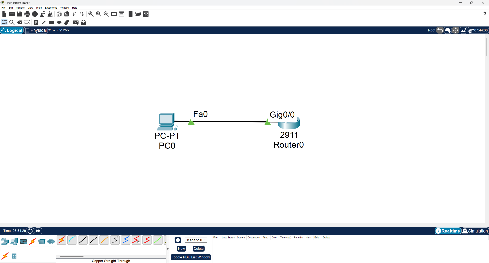
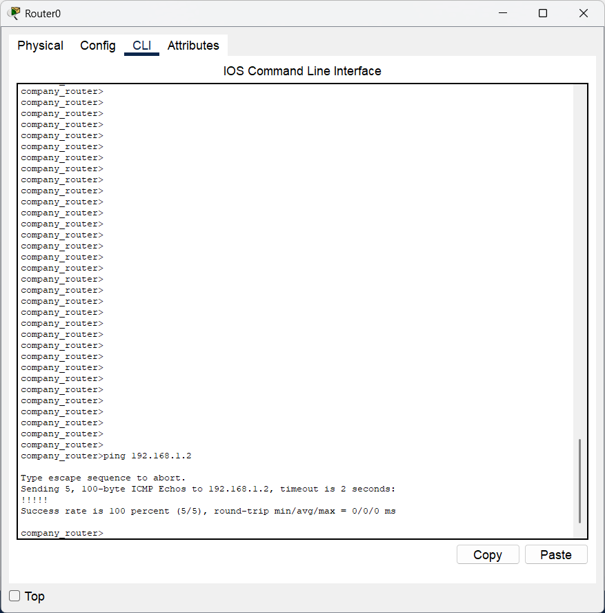
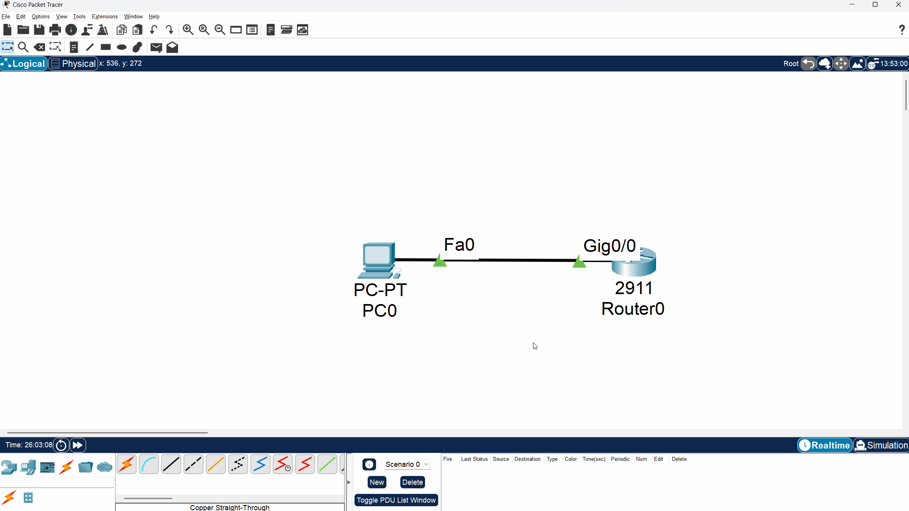
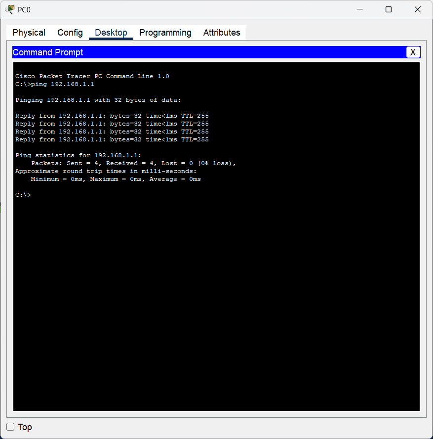
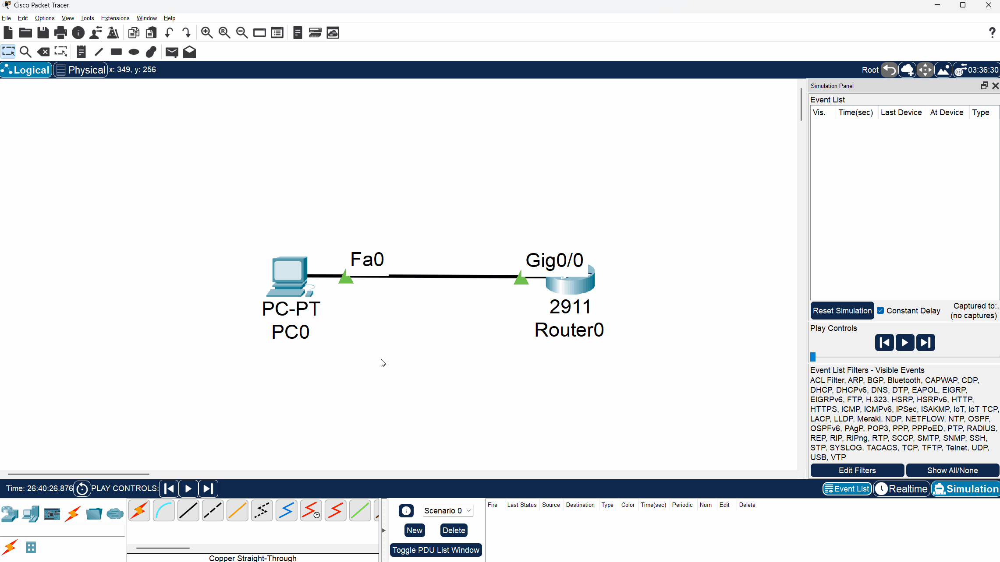

# 🖥️ CCNA Lab 02-03: Router Interface and DHCP Configuration

## 📌 Objective

The purpose of this lab is to perform two fundamental router configurations:
1.  **Assign a static IP address** to a router's Gigabit Ethernet interface.
2.  **Configure the router to act as a DHCP server** to automatically assign an IP address to a directly connected PC.

---

## 🗂️ Topology

The lab consists of a single **Cisco 2911 router** connected directly to a **PC**.

*   **Router Interface:** `GigabitEthernet0/0`
*   **PC Interface:** `FastEthernet0`



---

## ▶️ Run the Lab

You can open and run the lab directly in **Cisco Packet Tracer**:

*   File: [`topology.pkt`](./topology.pkt)
*   Software required: **Cisco Packet Tracer (v8.x or later)**

---

## ⚙️ Configuration Steps

This lab is broken into two main parts: Interface Configuration and DHCP Configuration.

### Part 1: Configure the Router Interface

First, we will configure the `GigabitEthernet0/0` interface, which is connected to the PC.

#### 1. Enter Global Configuration Mode
```bash
enable
configure terminal
```

#### 2. Select the Interface
```bash
interface GigabitEthernet0/0
```

#### 3. Assign an IP Address and Subnet Mask
```bash
ip address 192.168.1.1 255.255.255.0
```

#### 4. Enable the Interface
By default, router interfaces are disabled. Use the `no shutdown` command to enable it.
```bash
no shutdown
```
You should see a log message indicating the interface state has changed to "up".

### Part 2: Configure the DHCP Server

Next, we will configure a DHCP pool on the router to lease an IP address to the PC.

#### 5. Create a DHCP Pool
Exit the interface configuration mode and create a new DHCP pool named `dhcb_1`.
```bash
exit
ip dhcp pool dhcb_1
```

#### 6. Define the Network
Specify the network address and subnet mask from which the DHCP server will lease an address.
```bash
network 192.168.1.0 255.255.255.0
```

#### 7. Define the Default Gateway
Provide the IP address of the router's interface, which will serve as the default gateway for the PC.
```bash
default-router 192.168.1.1
```

#### 8. (Optional) Define a DNS Server
Provide a DNS server address to be assigned to the PC.
```bash
dns-server 8.8.8.8
```

#### 9. Exit & Save Configuration
```bash
end
write memory
# OR
copy running-config startup-config
```

---

## 🔍 Verification

After configuration, you can verify your settings from both the router and the PC.

### From the Router:

*   **Check Interface Status**: Ensure G0/0 is "up" and has the correct IP address.
    ```bash
    show ip interface brief
    ```
*   **Check DHCP Leases**: See which IP addresses have been leased.
    ```bash
    show ip dhcp binding
    ```
*   **Test Connectivity**: Ping the PC after it receives an IP address from the DHCP server.
    ```bash
    ping <PC-IP-ADDRESS>
    ```
    

### From the PC:

*   **Obtain IP via DHCP**: Navigate to the PC's Desktop > IP Configuration and select DHCP. The PC should receive an IP address.
    
*   **Test Connectivity**: Open the Command Prompt on the PC and ping the router's IP address (the default gateway).
    ```bash
    ping 192.168.1.1
    ```
    

### Message Simulation

You can also use Packet Tracer's simulation mode to visualize the ICMP (ping) packets traveling between the PC and the router.



---

## ✅ Expected Output

*   The `show running-config` command on the router should display:
    ```
    !
    ip dhcp pool dhcb_1
     network 192.168.1.0 255.255.255.0
     default-router 192.168.1.1
     dns-server 8.8.8.8
    !
    ...
    !
    interface GigabitEthernet0/0
     ip address 192.168.1.1 255.255.255.0
     duplex auto
     speed auto
    !
    ```

---

## 📂 Repository Structure

```
02-03-router-interface-dhcp
 ├── README.md               # Lab instructions & documentation
 ├── topology.pkt            # Packet Tracer file
 ├── configs
 │    └── commands.txt       # All CLI commands used in this lab
 └── diagrams
      ├── message_simulation.gif
      ├── pc_ping_on_router_ip.png
      ├── pc_take_ip_by_dhcp.gif
      ├── router_ping_on_pc_ip.png
      └── topology.png
```

---

## 🎯 Learning Outcome

By completing this lab, you have learned how to:

*   Configure a static IPv4 address on a router interface.
*   Enable a router interface.
*   Configure a router to function as a DHCP server.
*   Define a DHCP address pool, default gateway, and DNS server.
*   Verify both interface and DHCP configurations.
