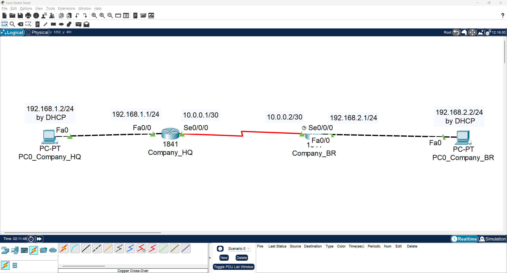
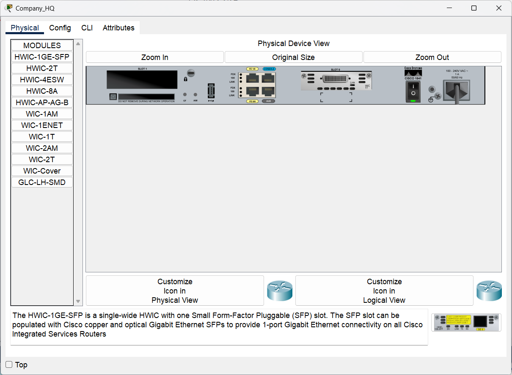
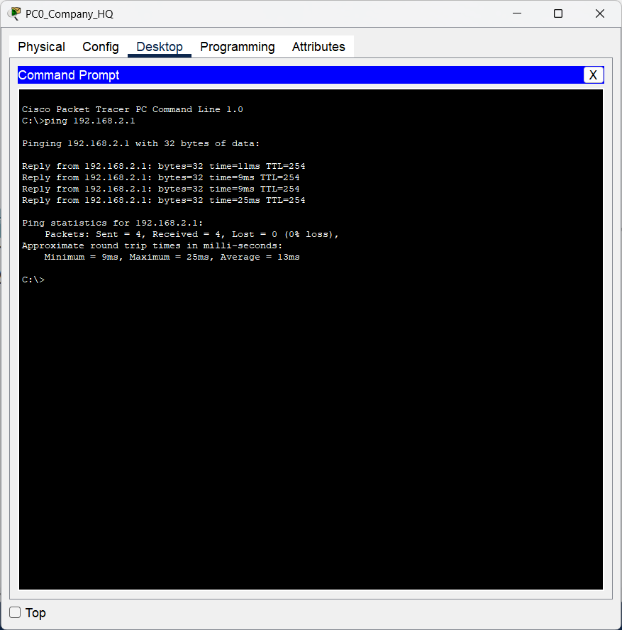
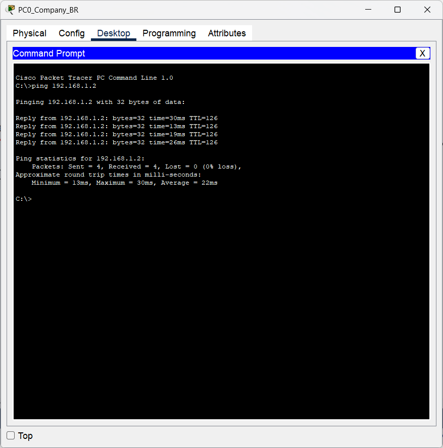
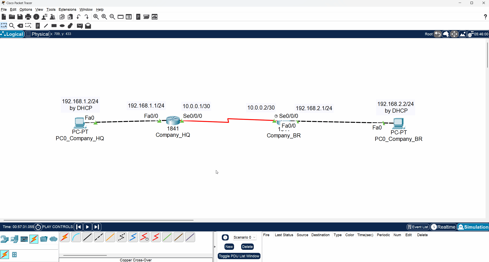

# 🖥️ CCNA Lab 04: Configuring IPv4 Static Routes

## 📌 Objective

The purpose of this lab is to configure **static routes** to enable communication between two separate local area networks (LANs) connected by different routers. This lab demonstrates how to manually define a path for data to travel to a remote network that is not directly connected.

Key tasks include:

1. **Configuring router interfaces** (FastEthernet for LAN, Serial for WAN)
2. **Setting up DHCP pools** on each router for their respective LANs
3. **Adding static routes** to each router's routing table

---

## 🗂️ Topology

The lab consists of two **Cisco 1841 routers** (`Company_HQ` and `Company_BR`), each connected to a local PC. The routers are linked via a point-to-point serial connection.

* **HQ Network:** `192.168.1.0/24`
* **Branch Network:** `192.168.2.0/24`
* **WAN Link:** `10.0.0.0/30`



### Physical Hardware

This lab uses two Cisco 1841 series routers, each equipped with a WIC-1T module to provide the necessary serial port for the WAN connection.

|                               Company_HQ Router (Physical View)                               |                               Company_BR Router (Physical View)                               |
| :-------------------------------------------------------------------------------------------: | :-------------------------------------------------------------------------------------------: |
|  |  |

---

## ▶️ Run the Lab

You can open and run the lab directly in **Cisco Packet Tracer**:

* File: [`topology.pkt`](./topology.pkt)
* Software required: **Cisco Packet Tracer (v8.x or later)**

---

## ⚙️ Configuration Steps

This lab is broken into two main parts: configuring the HQ router and configuring the Branch router.

### Part 1: Configure the `Company_HQ` Router

#### 1. Enter Global Configuration Mode & Basic Setup

```bash
enable
configure terminal
hostname Company_HQ
enable secret cisco
```

#### 2. Configure the LAN Interface (Fa0/0)

This interface connects to the `192.168.1.0/24` network.

```bash
interface FastEthernet0/0
 ip address 192.168.1.1 255.255.255.0
 no shutdown
 exit
```

#### 3. Configure DHCP for the HQ LAN

This provides an IP address to `PC0_Company_HQ`.

```bash
ip dhcp pool dhcp_HQ_1
 network 192.168.1.0 255.255.255.0
 default-router 192.168.1.1
 dns-server 8.8.8.8
 exit
```

#### 4. Configure the WAN Interface (Se0/0/0)

This is the link to the `Company_BR` router.

```bash
interface Serial0/0/0
 ip address 10.0.0.1 255.255.255.252
 no shutdown
 exit
```

#### 5. Configure the Static Route

This command tells `Company_HQ` how to reach the `Company_BR` LAN (`192.168.2.0/24`) through its own `Serial0/0/0` interface.

```bash
ip route 192.168.2.0 255.255.255.0 Serial0/0/0
```

---

### Part 2: Configure the `Company_BR` Router

#### 1. Enter Global Configuration Mode & Basic Setup

```bash
enable
configure terminal
hostname Company_BR
enable secret cisco
```

#### 2. Configure the LAN Interface (Fa0/0)

This interface connects to the `192.168.2.0/24` network.

```bash
interface FastEthernet0/0
 ip address 192.168.2.1 255.255.255.0
 no shutdown
 exit
```

#### 3. Configure DHCP for the BR LAN

This provides an IP address to `PC0_Company_BR`.

```bash
ip dhcp pool dhcp_BR_1
 network 192.168.2.0 255.255.255.0
 default-router 192.168.2.1
 dns-server 8.8.8.8
 exit
```

#### 4. Configure the WAN Interface (Se0/0/0)

This is the link back to the `Company_HQ` router.

```bash
interface Serial0/0/0
 ip address 10.0.0.2 255.255.255.252
 no shutdown
 exit
```

#### 5. Configure the Static Route

This command tells `Company_BR` how to reach the `Company_HQ` LAN (`192.168.1.0/24`).

```bash
ip route 192.168.1.0 255.255.255.0 Serial0/0/0
```

---

### Part 3: Save Configuration

Save the running configuration on **both** routers.

```bash
end
write memory
```

---

## 🔍 Verification

After configuration, verify that the two LANs can communicate.

### From the Routers

**Check the Routing Table:** Ensure the static route (marked with an `S`) is present.

```bash
show ip route
```

**Check Interface Status:** Ensure all configured interfaces are "up".

```bash
show ip interface brief
```

### From the PCs

* **Obtain IP via DHCP:** Ensure both PCs have received an IP address from their respective routers.
* **Test Connectivity to Remote Gateway:** From `PC0_Company_HQ`, ping the `Company_BR` router's Fa0/0 interface.

```bash
ping 192.168.2.1
```



* **Test End-to-End Connectivity:** From `PC0_Company_BR`, ping `PC0_Company_HQ`.

```bash
ping 192.168.1.2
```



---

### Message Simulation

You can also use Packet Tracer's simulation mode to visualize the ICMP (ping) packets traveling between the two LANs across the WAN link.



---

## ✅ Expected Output

**Output of `show ip route` on `Company_HQ`:**

```
Gateway of last resort is not set

     10.0.0.0/30 is subnetted, 1 subnets
C       10.0.0.0 is directly connected, Serial0/0/0
C    192.168.1.0/24 is directly connected, FastEthernet0/0
S    192.168.2.0/24 is directly connected, Serial0/0/0
```

**Output of `show ip route` on `Company_BR`:**

```
Gateway of last resort is not set

     10.0.0.0/30 is subnetted, 1 subnets
C       10.0.0.0 is directly connected, Serial0/0/0
S    192.168.1.0/24 is directly connected, Serial0/0/0
C    192.168.2.0/24 is directly connected, FastEthernet0/0
```

---

## 📂 Repository Structure

```
04-static-routing
 ├── README.md               # Lab instructions & documentation
 ├── topology.pkt            # Packet Tracer file
 ├── configs
 │    └── commands.txt       # All CLI commands used in this lab
 └── diagrams
      ├── message_simulation_between_two_lans.gif
      ├── physical_show_of_router1841_company_br.png
      ├── physical_show_of_router1841_company_hq.png
      ├── ping_from_company_br_pc_to_company_hq_pc.png
      ├── ping_from_company_hq_pc_to_company_br_router.png
      └── topology.png
```

---

## 🎯 Learning Outcome

By completing this lab, you have learned how to:

* Configure static IPv4 routes to connect remote networks
* Configure serial interfaces for point-to-point WAN links
* Set up multiple routers to provide DHCP services to their local networks
* Verify routing tables and end-to-end connectivity between different networks
