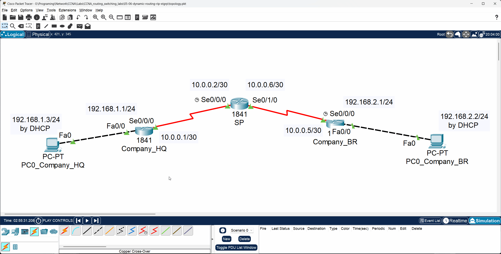

# 🖥️ CCNA Labs 05–06: Configuring Dynamic Routing (RIP & EIGRP)

## 📌 Objective

The purpose of this lab is to **configure, verify, and compare** two common dynamic routing protocols — **RIP (Routing Information Protocol)** and **EIGRP (Enhanced Interior Gateway Routing Protocol)**.

Unlike static routing, dynamic routing protocols allow routers to **automatically discover remote networks** and **exchange routing information** with their neighbors.

### Key Tasks

1. Configure basic device settings on three routers.
2. Implement **RIPv2** and verify its operation.
3. Implement **EIGRP** and verify its operation.
4. Compare the routing tables produced by each protocol.

---

## 🗂️ Topology

The lab consists of three **Cisco 1841 routers**.
`Company_HQ` and `Company_BR` are connected through a central **Service Provider (SP)** router.
Each company router connects to its own local PC.

| Network         | Address          |
| :-------------- | :--------------- |
| **HQ LAN**      | `192.168.1.0/24` |
| **Branch LAN**  | `192.168.2.0/24` |
| **WAN (HQ–SP)** | `10.0.0.0/30`    |
| **WAN (SP–BR)** | `10.0.0.4/30`    |


---

### 🧱 Physical Hardware

This lab uses **three Cisco 1841 routers**, each with serial ports for WAN links.

|                               Company_HQ Router                              |                          SP Router                          |                               Company_BR Router                              |
| :--------------------------------------------------------------------------: | :---------------------------------------------------------: | :--------------------------------------------------------------------------: |
|  |  |  |

---

## ▶️ Run the Lab

You can open and run this topology directly in **Cisco Packet Tracer**:

* **File:** [`topology.pkt`](./topology.pkt)
* **Software Required:** Cisco Packet Tracer **v8.x or later**

---

## ⚙️ Configuration Steps

This lab is divided into three main parts:

1. **Basic device and interface configuration**
2. **RIPv2 configuration**
3. **EIGRP configuration**

---

### Part 1: Basic Device & Interface Configuration

Configure the hostname, enable secret, interfaces, and DHCP pools on `Company_HQ` and `Company_BR`.
On the `SP` router, configure the hostname, secret, and serial interfaces only.

➡️ Refer to [`configs/commands.txt`](./configs/commands.txt) for detailed commands.

**Example – Company_HQ LAN Interface:**

```bash
interface FastEthernet0/0
 ip address 192.168.1.1 255.255.255.0
 no shutdown
```

**Example – SP WAN Interface:**

```bash
interface Serial0/0/0
 ip address 10.0.0.2 255.255.255.252
 no shutdown
```

---

### Part 2: Configure RIPv2

Enable RIP routing (version 2) on all routers and disable automatic summarization.

**Company_HQ:**

```bash
router rip
 version 2
 network 192.168.1.0
 network 10.0.0.0
 no auto-summary
```

**SP:**

```bash
router rip
 version 2
 network 10.0.0.0
 network 10.0.0.4
 no auto-summary
```

**Company_BR:**

```bash
router rip
 version 2
 network 192.168.2.0
 network 10.0.0.4
 no auto-summary
```

---

### Part 3: Configure EIGRP

Remove RIP before configuring EIGRP:

```bash
no router rip
```

Then configure **EIGRP** using AS number **222**.

**Company_HQ:**

```bash
router eigrp 222
 network 192.168.1.0
 network 10.0.0.0
 no auto-summary
```

**SP:**

```bash
router eigrp 222
 network 10.0.0.0
 network 10.0.0.4
 no auto-summary
```

**Company_BR:**

```bash
router eigrp 222
 network 192.168.2.0
 network 10.0.0.4
 no auto-summary
```

---

## 🔍 Verification

After configuration, verify LAN-to-LAN communication and routing tables.

### 1. Interface Status

```bash
show ip interface brief
```

### 2. Routing Table

Check learned routes:

```bash
show ip route
```

* RIP-learned routes are marked **R**
* EIGRP-learned routes are marked **D**

### 3. End-to-End Connectivity

**From PC_Company_HQ to PC_Company_BR:**

```bash
ping 192.168.2.2
```


**From PC_Company_BR to PC_Company_HQ:**

```bash
ping 192.168.1.3
```


---

### 🛰️ Message Simulation

Use **Simulation Mode** in Packet Tracer to visualize ICMP packets moving between LANs.



---

## ✅ Expected Output

### RIP Example (`show ip route` on Company_HQ)

```
     10.0.0.0/30 is subnetted, 2 subnets
C       10.0.0.0 is directly connected, Serial0/0/0
R       10.0.0.4 [120/1] via 10.0.0.2, 00:00:14, Serial0/0/0
C    192.168.1.0/24 is directly connected, FastEthernet0/0
R    192.168.2.0/24 [120/2] via 10.0.0.2, 00:00:14, Serial0/0/0
```

### RIP Example (`show ip route` on SP)

```
     10.0.0.0/30 is subnetted, 2 subnets
C       10.0.0.0 is directly connected, Serial0/0/0
C       10.0.0.4 is directly connected, Serial0/1/0
R    192.168.1.0/24 [120/1] via 10.0.0.1, 00:00:19, Serial0/0/0
R    192.168.2.0/24 [120/1] via 10.0.0.5, 00:00:21, Serial0/1/0
```

---

### EIGRP Example (`show ip route` on Company_HQ)

```
     10.0.0.0/30 is subnetted, 2 subnets
C       10.0.0.0 is directly connected, Serial0/0/0
D       10.0.0.4 [90/21024000] via 10.0.0.2, 00:04:30, Serial0/0/0
C    192.168.1.0/24 is directly connected, FastEthernet0/0
D    192.168.2.0/24 [90/21026560] via 10.0.0.2, 00:01:53, Serial0/0/0
```

### EIGRP Example (`show ip route` on SP)

```
     10.0.0.0/30 is subnetted, 2 subnets
C       10.0.0.0 is directly connected, Serial0/0/0
C       10.0.0.4 is directly connected, Serial0/1/0
D    192.168.1.0/24 [90/20514560] via 10.0.0.1, 00:03:41, Serial0/0/0
D    192.168.2.0/24 [90/20514560] via 10.0.0.5, 00:01:04, Serial0/1/0
```

---

## 📂 Repository Structure

```
05-06-dynamic-routing-rip-eigrp/
├── README.md               # Lab instructions & documentation
├── topology.pkt            # Packet Tracer file
├── configs/
│   └── commands.txt       # All CLI commands used in this lab
└── diagrams/
    ├── message_simulation_between_two_lans.gif
    ├── physical_show_of_router1841_company_br.png
    ├── physical_show_of_router1841_company_hq.png
    ├── physical_show_of_router1841_sp.png
    ├── ping_from_company_br_pc_to_company_hq_pc.png
    ├── ping_from_company_hq_pc_to_company_br_pc.png
    └── topology.png
```

---

## 🎯 Learning Outcomes

By completing this lab, you have learned to:

* Configure a multi-router topology with a central transit router.
* Implement **RIPv2** and **EIGRP** dynamic routing protocols.
* Verify routing tables and identify protocol differences.
* Understand **administrative distance** and **metric** differences between RIP and EIGRP.
