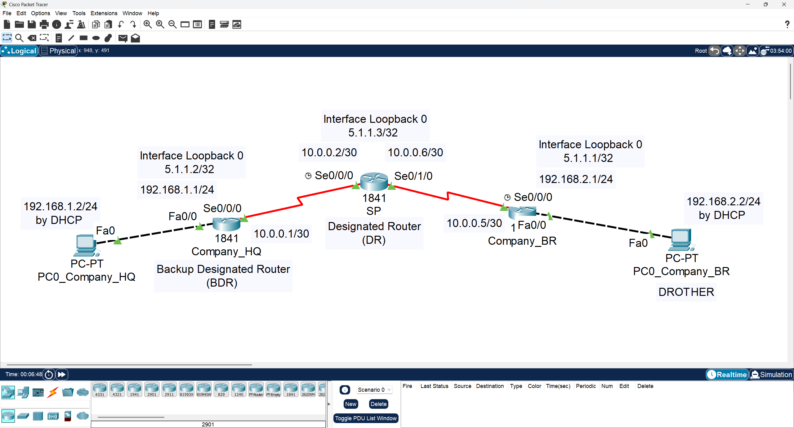
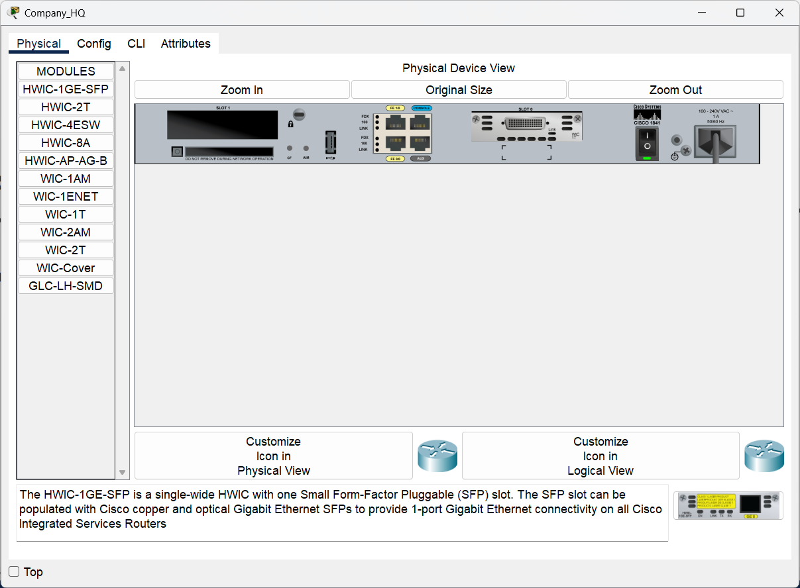
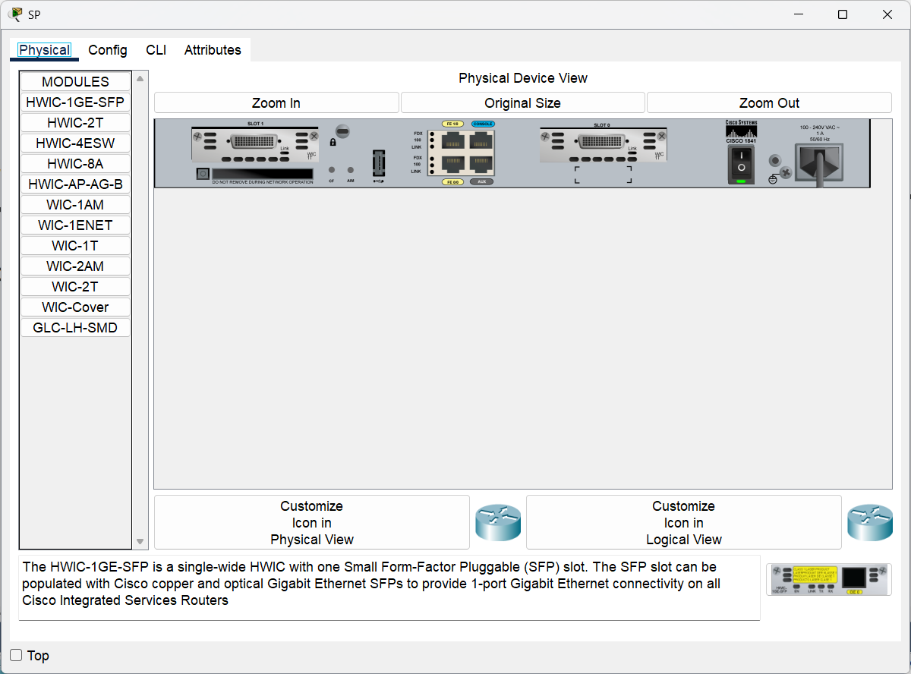
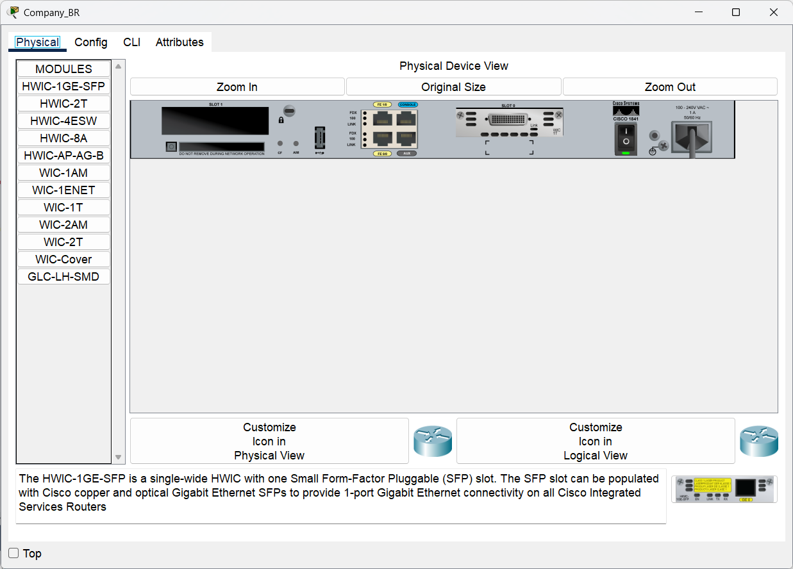
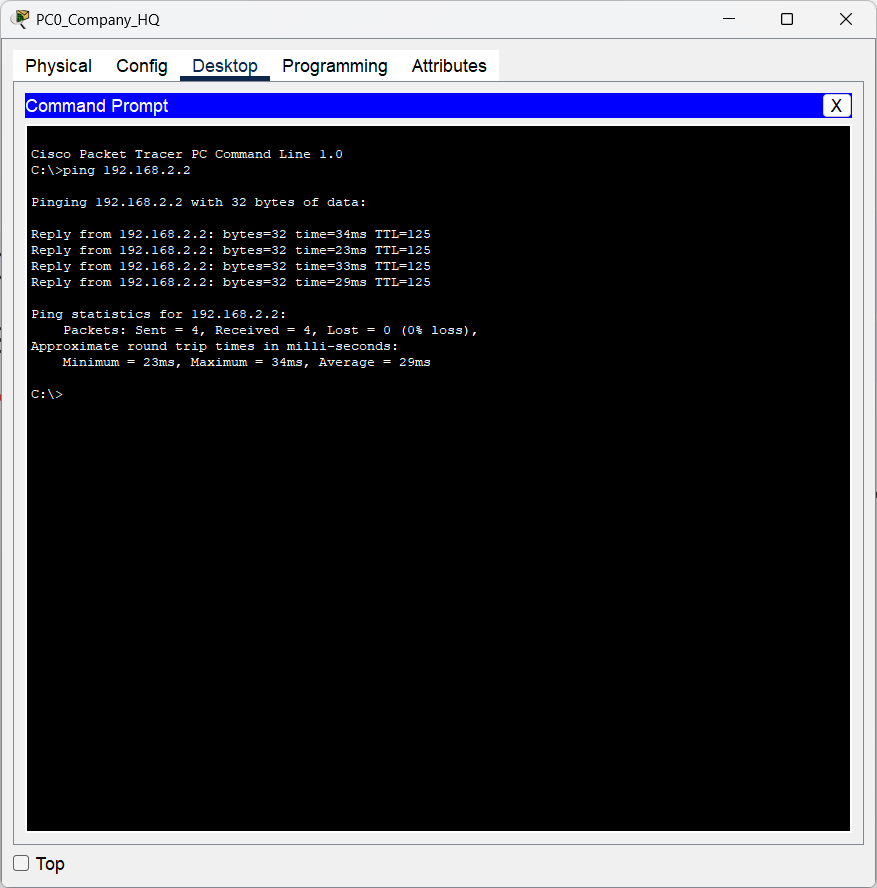
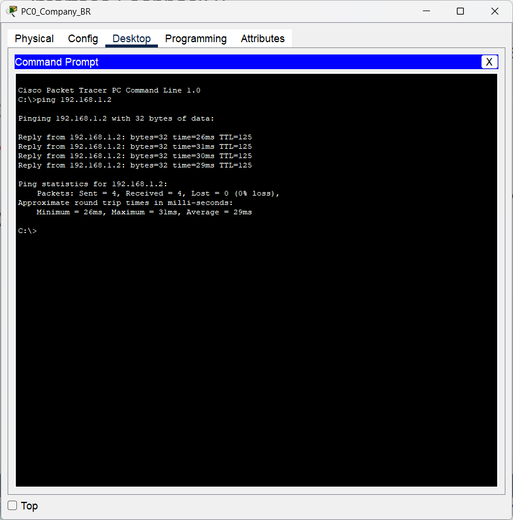
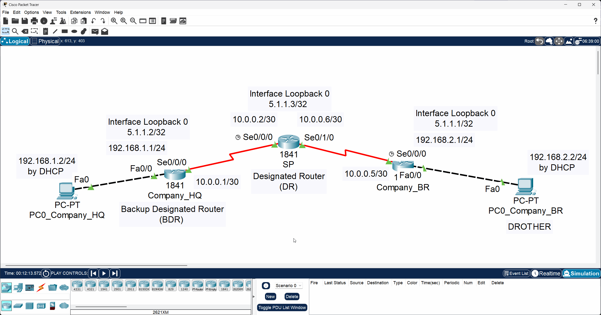

# 🖥️ CCNA Labs 07: Configuring OSPF Routing

## 📌 Objective

The purpose of this lab is to **configure, verify, and troubleshoot** the **OSPF (Open Shortest Path First)** dynamic routing protocol. OSPF is a link-state routing protocol that provides faster convergence and scalability compared to distance-vector protocols like RIP.

### Key Tasks

1. Configure basic device settings on three routers.
2. Implement OSPF routing and verify its operation.
3. Verify OSPF neighbor relationships and routing tables.

---

## 🗂️ Topology

The lab consists of three **Cisco 1841 routers**: `Company_HQ`, `Company_BR`, and a central **SP (Service Provider)** router. Each company router connects to its own local PC.

| Network         | Address          |
| :-------------- | :--------------- |
| **HQ LAN**      | `192.168.1.0/24` |
| **Branch LAN**  | `192.168.2.0/24` |
| **WAN (HQ–SP)** | `10.0.0.0/30`    |
| **WAN (SP–BR)** | `10.0.0.4/30`    |
| **Loopback 0 (HQ)** | `5.1.1.2/32`    |
| **Loopback 0 (SP)** | `5.1.1.3/32`    |
| **Loopback 0 (BR)** | `5.1.1.1/32`    |



---

### 🧱 Physical Hardware

This lab uses **three Cisco 1841 routers**, each with serial ports for WAN links.

|                               Company_HQ Router                              |                          SP Router                          |                               Company_BR Router                              |
| :--------------------------------------------------------------------------: | :---------------------------------------------------------: | :--------------------------------------------------------------------------: |
|  |  |  |

---

## ▶️ Run the Lab

You can open and run this topology directly in **Cisco Packet Tracer**:

* **File:** [`topology.pkt`](./topology.pkt)
* **Software Required:** Cisco Packet Tracer **v8.x or later**

---

## ⚙️ Configuration Steps

This lab is divided into two main parts:

1. **Basic device and interface configuration**
2. **OSPF configuration**

---

### Part 1: Basic Device & Interface Configuration

Configure the hostname, enable secret, interfaces, DHCP pools, and loopback interfaces on all routers.

➡️ Refer to [`configs/commands.txt`](./configs/commands.txt) for detailed commands.

**Example – Company_HQ LAN Interface:**

```bash
interface FastEthernet0/0
 ip address 192.168.1.1 255.255.255.0
 no shutdown
```

**Example – SP WAN Interface:**

```bash
interface Serial0/0/0
 ip address 10.0.0.2 255.255.255.252
 no shutdown
```

---

### Part 2: Configure OSPF

Enable OSPF routing (process ID 1) on all routers with a network statement covering all interfaces.

**Company_HQ:**

```bash
router ospf 1
 network 0.0.0.0 255.255.255.255 area 0
```

**SP:**

```bash
router ospf 1
 network 0.0.0.0 255.255.255.255 area 0
```

**Company_BR:**

```bash
router ospf 1
 network 0.0.0.0 255.255.255.255 area 0
```

---

## 🔍 Verification

After configuration, verify LAN-to-LAN communication, routing tables, and OSPF neighbor relationships.

### 1. Interface Status

```bash
show ip interface brief
```

### 2. Routing Table

Check learned routes:

```bash
show ip route
```

* OSPF-learned routes are marked **O**

### 3. OSPF Neighbors

Verify neighbor relationships:

```bash
show ip ospf neighbor
```

### 4. End-to-End Connectivity

**From PC_Company_HQ to PC_Company_BR:**

```bash
ping 192.168.2.2
```



**From PC_Company_BR to PC_Company_HQ:**

```bash
ping 192.168.1.2
```



---

### 🛰️ Message Simulation

Use **Simulation Mode** in Packet Tracer to visualize ICMP packets moving between LANs.



---

## ✅ Expected Output

### Routing Table Example (`show ip route` on Company_HQ)

```
     5.0.0.0/32 is subnetted, 3 subnets
O       5.1.1.1 [110/129] via 10.0.0.2, 00:25:17, Serial0/0/0
C       5.1.1.2 is directly connected, Loopback0
O       5.1.1.3 [110/65] via 10.0.0.2, 00:25:17, Serial0/0/0
     10.0.0.0/30 is subnetted, 2 subnets
C       10.0.0.0 is directly connected, Serial0/0/0
O       10.0.0.4 [110/128] via 10.0.0.2, 00:25:17, Serial0/0/0
C    192.168.1.0/24 is directly connected, FastEthernet0/0
O    192.168.2.0/24 [110/129] via 10.0.0.2, 00:25:17, Serial0/0/0
```

### Routing Table Example (`show ip route` on SP)

```
     5.0.0.0/32 is subnetted, 3 subnets
O       5.1.1.1 [110/65] via 10.0.0.5, 00:24:20, Serial0/1/0
O       5.1.1.2 [110/65] via 10.0.0.1, 00:24:20, Serial0/0/0
C       5.1.1.3 is directly connected, Loopback0
     10.0.0.0/30 is subnetted, 2 subnets
C       10.0.0.0 is directly connected, Serial0/0/0
C       10.0.0.4 is directly connected, Serial0/1/0
O    192.168.1.0/24 [110/65] via 10.0.0.1, 00:24:20, Serial0/0/0
O    192.168.2.0/24 [110/65] via 10.0.0.5, 00:24:20, Serial0/1/0
```

### OSPF Neighbor Example (`show ip ospf neighbor` on Company_HQ)

```
Neighbor ID     Pri   State           Dead Time   Address         Interface
5.1.1.3           1   FULL/DR         00:00:37    10.0.0.2        Serial0/0/0
```
### OSPF Neighbor Example (`show ip ospf neighbor` on SP)

```
Neighbor ID     Pri   State           Dead Time   Address         Interface
5.1.1.1           1   FULL/BDR        00:00:30    10.0.0.5        Serial0/1/0
5.1.1.2           1   FULL/BDR        00:00:30    10.0.0.1        Serial0/0/0
```
---

## 📂 Repository Structure

```
07-ospf-routing/
├── README.md               # Lab instructions & documentation
├── topology.pkt            # Packet Tracer file
├── configs/
│   └── commands.txt       # All CLI commands used in this lab
└── diagrams/
    ├── message_simulation_between_two_lans.gif
    ├── physical_show_of_router1841_company_br.png
    ├── physical_show_of_router1841_company_hq.png
    ├── physical_show_of_router1841_sp.png
    ├── ping_from_company_br_pc_to_company_hq_pc.png
    ├── ping_from_company_hq_pc_to_company_br_pc.png
    └── topology.png
```

---

## 🎯 Learning Outcomes

By completing this lab, you have learned to:

* Configure a multi-router topology with OSPF.
* Implement OSPF dynamic routing protocol.
* Verify routing tables and OSPF neighbor relationships.
* Understand OSPF metrics and adjacency states.
