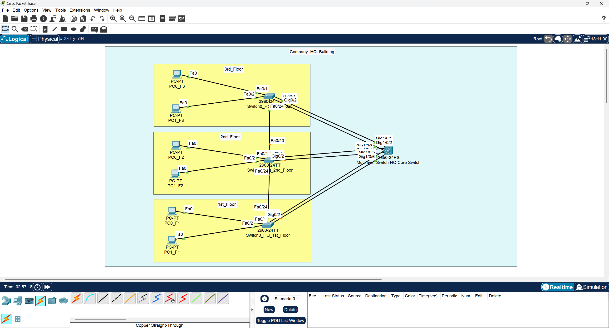
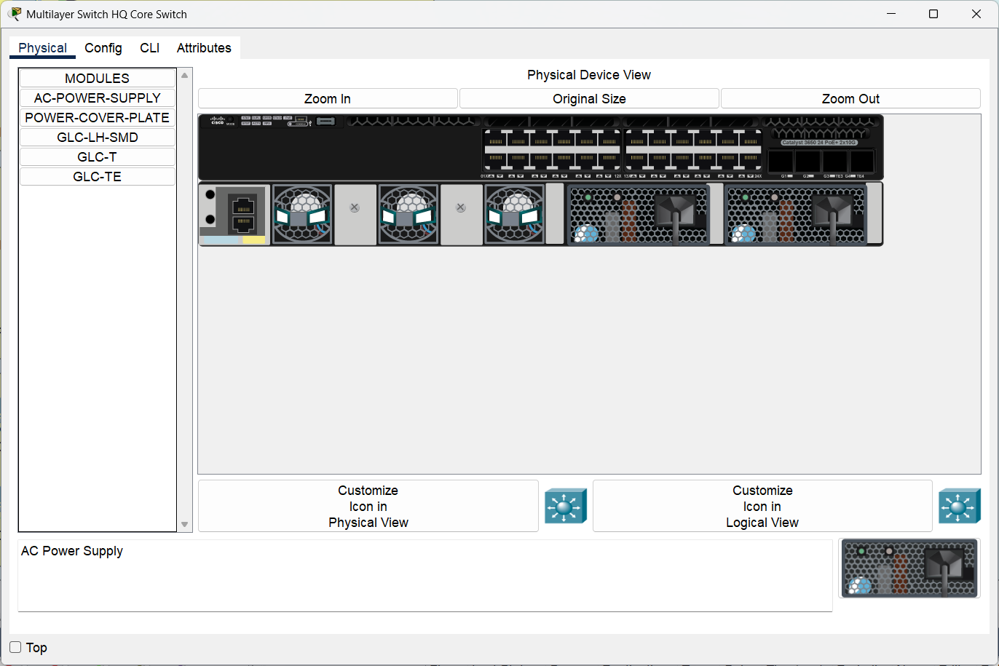
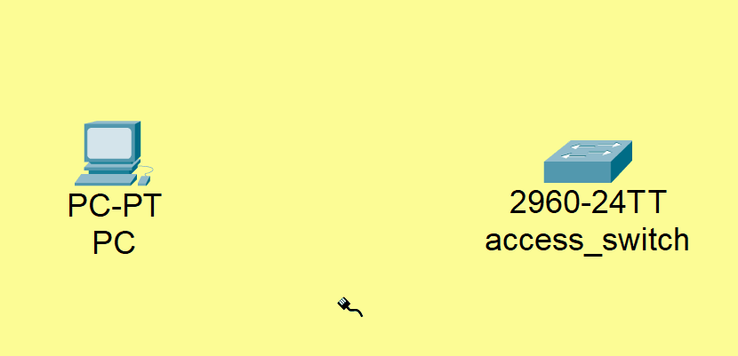
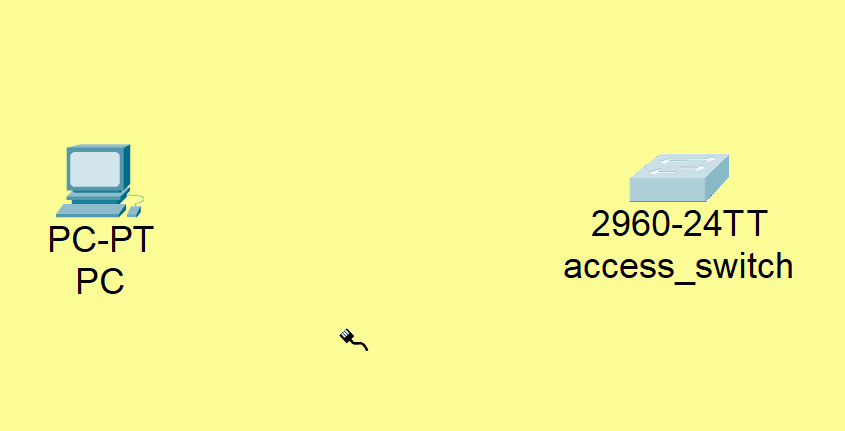
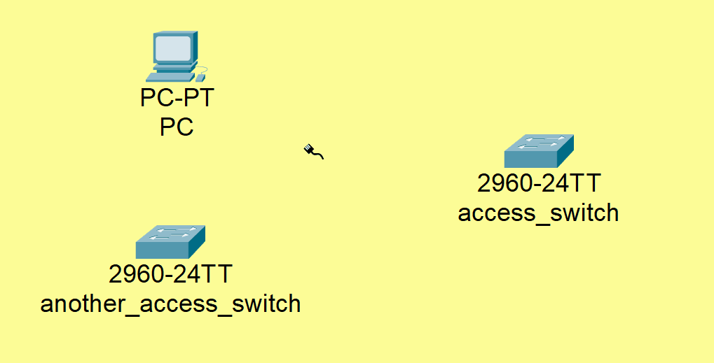

# 🖥️ CCNA Lab 08: Configuring Spanning Tree Protocol (STP)

## 📌 Objective

The purpose of this lab is to configure and verify Spanning Tree Protocol (STP) in a multi-switch environment. This lab focuses on ensuring network stability by preventing Layer 2 loops and optimizing convergence time with features like **PortFast** and **BPDU Guard**.

### Key Tasks

1.  Configure basic device settings on a core multilayer switch and three access layer switches.
2.  Manipulate the STP root bridge election by setting the priority on the core switch.
3.  Enable **PortFast** on access ports to minimize the time it takes for end-user devices to connect to the network.
4.  Secure the network edge by enabling **BPDU Guard** on PortFast-enabled interfaces.
5.  Verify the STP topology and the status of switch ports.

---

## 🗂️ Topology

The lab consists of one **Cisco 3650-24PS multilayer switch** acting as the core of the network at the company's headquarters. Three **Cisco 2960-24TT switches** provide access layer connectivity for the first, second, and third floors. Redundant links exist between the access switches and the core switch to provide high availability.



---

### 🧱 Physical Hardware

This lab uses one **Cisco 3650-24PS** as the core switch and three **Cisco 2960-24TT** switches as access switches.

| Multilayer Core Switch (HQ) | Access Switches (Per Floor) |
| :---: | :---: |
|  |  |

---

## ▶️ Run the Lab

You can open and run this topology directly in **Cisco Packet Tracer**:

*   **File:** [`topology.pkt`](./topology.pkt)
*   **Software Required:** Cisco Packet Tracer **v8.x or later**

---

## ⚙️ Configuration Steps

This lab is divided into three main parts:

1.  **Basic device configuration**
2.  **STP Root Bridge Configuration**
3.  **PortFast and BPDU Guard Configuration**

---

### Part 1: Basic Device Configuration

Configure the hostname and enable secret on all switches.

➡️ Refer to [`configs/commands.txt`](./configs/commands.txt) for detailed commands.

**Example – Core Switch:**

```bash
enable
configure terminal
hostname core-switch0-HQ
enable secret pass0c0
```

---

### Part 2: Configure the STP Root Bridge

To ensure the core switch becomes the root bridge for all VLANs, set its spanning-tree priority to 0.

**Core Switch:**

```bash
spanning-tree vlan 1-4094 priority 0
```

---

### Part 3: Configure PortFast and BPDU Guard

On the access layer switches (`switch0_HQ_F1`, `switch0_HQ_F2`, and `switch0_HQ_F3`), enable PortFast on the interfaces connected to end devices to allow them to bypass the STP listening and learning states. Also, enable BPDU Guard to protect the network from unauthorized switches being connected.

**Access Switches (Example on `switch0_HQ_F1`):**

```bash
interface range FastEthernet0/1 - 23
 spanning-tree portfast
 spanning-tree bpduguard enable```

---

## 🔍 Verification

After configuration, you can verify the STP topology and the port states.

### 1. Verify the Root Bridge

On the core switch, use the `show spanning-tree` command to confirm it is the root bridge.

```bash
show spanning-tree
```

### 2. Verify Access Port Status

On the access switches, the output of `show spanning-tree` will show that the root port is forwarding and the alternate port is in a blocking state.

---

### 🛰️ Simulation

Observe the behavior of the network with and without PortFast enabled.

| Before PortFast | After PortFast |
| :---: | :---: |
|  |  |

You can also see how BPDU Guard protects the network by shutting down a port if a switch is connected to it.



---

## ✅ Expected Output

### Core Switch (`show spanning-tree`)

The output should indicate "This bridge is the root".

```
VLAN0001
  Spanning tree enabled protocol ieee
  Root ID    Priority    1
             Address     0003.E4AE.7087
             This bridge is the root
             Hello Time  2 sec  Max Age 20 sec  Forward Delay 15 sec

  Bridge ID  Priority    1  (priority 0 sys-id-ext 1)
             Address     0003.E4AE.7087
             Hello Time  2 sec  Max Age 20 sec  Forward Delay 15 sec
             Aging Time  20

Interface        Role Sts Cost      Prio.Nbr Type
---------------- ---- --- --------- -------- --------------------------------
Gi1/0/2          Desg FWD 4         128.2    P2p
Gi1/0/6          Desg FWD 4         128.6    P2p
Gi1/0/1          Desg FWD 4         128.1    P2p
Gi1/0/5          Desg FWD 4         128.5    P2p
Gi1/0/4          Desg FWD 4         128.4    P2p
Gi1/0/3          Desg FWD 4         128.3    P2p
```

### Access Switch (`show spanning-tree` on `switch0_HQ_F1`)

The output will show the Root ID of the core switch and the status of its interfaces. Note that one of the redundant uplinks is in the `Altn BLK` (Alternate Blocking) state to prevent a loop.

```
VLAN0001
  Spanning tree enabled protocol ieee
  Root ID    Priority    1
             Address     0003.E4AE.7087
             Cost        4
             Port        25(GigabitEthernet0/1)
             Hello Time  2 sec  Max Age 20 sec  Forward Delay 15 sec

  Bridge ID  Priority    32769  (priority 32768 sys-id-ext 1)
             Address     000A.4146.22C9
             Hello Time  2 sec  Max Age 20 sec  Forward Delay 15 sec
             Aging Time  20

Interface        Role Sts Cost      Prio.Nbr Type
---------------- ---- --- --------- -------- --------------------------------
Fa0/1            Desg FWD 19        128.1    P2p
Fa0/2            Desg FWD 19        128.2    P2p
Fa0/24           Desg FWD 19        128.24   P2p
Gi0/1            Root FWD 4         128.25   P2p
Gi0/2            Altn BLK 4         128.26   P2p
```

---

## 📂 Repository Structure

```
08-switching-stp/
├── README.md               # Lab instructions & documentation
├── topology.pkt            # Packet Tracer file
├── configs/
│   └── commands.txt        # All CLI commands used in this lab
└── diagrams/
    ├── after_spanning-tree_portfast.gif
    ├── before_spanning-tree_portfast.gif
    ├── physical_show_of_access_switch2960-24TT_in_each_floor_in_company_hq.png
    ├── physical_show_of_multilayer_core_switch3650-24ps_company_hq.png
    ├── spanning-tree_portfast_with_bpduguard_pc_and_switch_behvier.gif
    └── topology.png
```

---

## 🎯 Learning Outcomes

By completing this lab, you have learned to:

*   Configure a hierarchical switched topology with a core and access layers.
*   Control the Spanning Tree Protocol root bridge election.
*   Implement **PortFast** to improve network convergence time for end devices.
*   Secure the switch access ports with **BPDU Guard**.
*   Verify and interpret the output of `show spanning-tree`.
