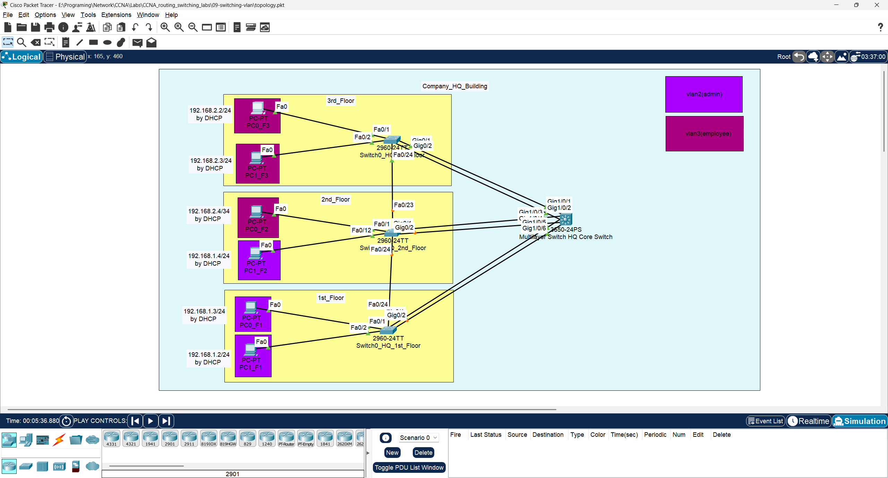
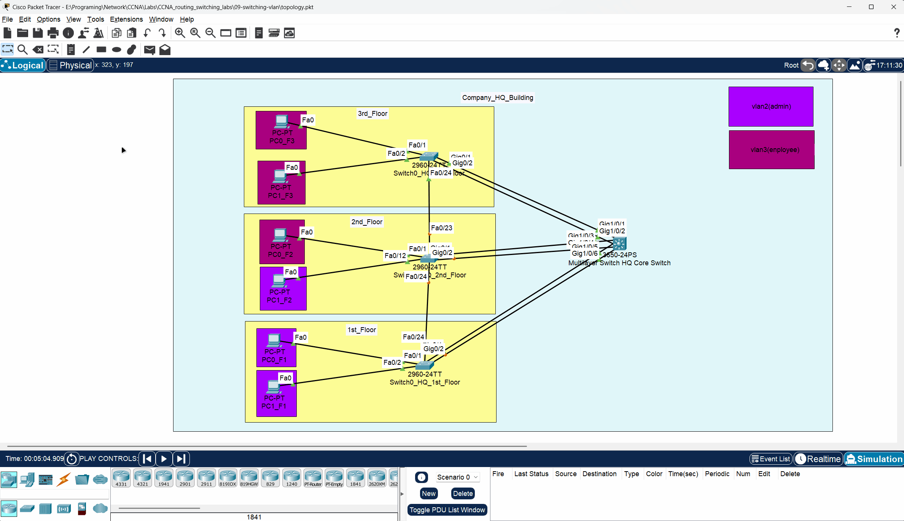

# 🖥️ CCNA Lab 09: Configuring VLANs and Inter-VLAN Routing

## 📌 Objective

The purpose of this lab is to segment a switched network using Virtual LANs (VLANs). This lab covers the configuration of VLANs, VTP (VLAN Trunking Protocol) for centralized VLAN management, trunk ports to carry traffic for multiple VLANs between switches, and Inter-VLAN routing on a multilayer switch to allow communication between different VLANs.

### Key Tasks

1.  Configure **VTP (VLAN Trunking Protocol)** on a core switch (server) and access switches (clients).
2.  Create VLANs on the VTP server, which will then propagate to the VTP clients.
3.  Configure **trunk links** between the core switch and access switches to carry traffic for all VLANs.
4.  Assign access ports on the switches to specific VLANs.
5.  Enable **Inter-VLAN routing** on the core multilayer switch using Switched Virtual Interfaces (SVIs).
6.  Configure **DHCP services** on the core switch to provide IP addresses to end devices in different VLANs.
7.  Verify connectivity between devices in the same VLAN and in different VLANs.

---

## 🗂️ Topology

The lab uses the same topology as the previous STP lab, consisting of one core multilayer switch and three access layer switches, with redundant links.



---

### 🧱 Physical Hardware

This lab uses one **Cisco 3650-24PS** as the core switch and three **Cisco 2960-24TT** switches as access switches.

| Multilayer Core Switch (HQ) | Access Switches (Per Floor) |
| :---: | :---: |
|  |  |

---

## ▶️ Run the Lab

You can open and run this topology directly in **Cisco Packet Tracer**:

*   **File:** [`topology.pkt`](./topology.pkt)
*   **Software Required:** Cisco Packet Tracer **v8.x or later**

---

## ⚙️ Configuration Steps

This lab is divided into five main parts:

1.  **VTP and VLAN Configuration on the Core Switch**
2.  **Inter-VLAN Routing and DHCP on the Core Switch**
3.  **VTP Client Configuration on Access Switches**
4.  **Trunk and Access Port Configuration**
5.  **Management IP Configuration on Access Switches**

➡️ Refer to [`configs/commands.txt`](./configs/commands.txt) for detailed commands for all devices.

---

### Part 1: Configure VTP and Create VLANs (Core Switch)

Set the core switch as the VTP server and create two VLANs: `admin` (VLAN 2) and `employee` (VLAN 3).

**Core Switch:**

```bash
vtp domain HQ
vtp mode server
vlan 2
 name admin
vlan 3
 name employee
```

---

### Part 2: Configure Inter-VLAN Routing and DHCP (Core Switch)

Enable IP routing and create SVIs for VLAN 2 and VLAN 3 to act as default gateways. Then, configure DHCP pools to serve IP addresses to these VLANs.

**Core Switch:**

```bash
ip routing
!
interface Vlan2
 ip address 192.168.1.1 255.255.255.0
 no shutdown
!
interface Vlan3
 ip address 192.168.2.1 255.255.255.0
 no shutdown
!
ip dhcp pool VLAN2_ADMIN_HQ
 network 192.168.1.0 255.255.255.0
 default-router 192.168.1.1
!
ip dhcp pool VLAN3_EMPLOYEE_HQ
 network 192.168.2.0 255.255.255.0
 default-router 192.168.2.1
```

---

### Part 3: Configure VTP Clients (Access Switches)

Configure the access switches to be VTP clients in the same VTP domain. They will automatically learn the VLANs created on the server.

**Access Switches (Example on `switch0_HQ_F1`):**

```bash
vtp mode client
vtp domain HQ
```

---

### Part 4: Configure Trunk and Access Ports

Set the links between switches as trunks to carry all VLAN traffic. Configure the ports connected to end devices as access ports and assign them to the appropriate VLAN.

**Core Switch (Uplinks):**

```bash
interface range GigabitEthernet1/0/1 - 6
 switchport mode trunk
```

**Access Switch (Example on `switch0_HQ_F2`):**

```bash
! Configure uplinks as trunks
interface range GigabitEthernet0/1 - 2
 switchport mode trunk
!
! Assign ports to VLAN 3 (employee)
interface range FastEthernet0/1 - 11
 switchport mode access
 switchport access vlan 3
!
! Assign ports to VLAN 2 (admin)
interface range FastEthernet0/12 - 22
 switchport mode access
 switchport access vlan 2
```

---

## 🔍 Verification

After configuration, verify that VLANs have been propagated and that inter-VLAN communication is working.

### 1. Verify VTP and VLANs

On any access switch, use `show vlan` to confirm that it has learned about VLAN 2 and VLAN 3 from the VTP server.

### 2. Verify DHCP

On the core switch, use `show ip dhcp binding` to see which end devices have received an IP address.

### 3. Verify Connectivity

Ping from a PC in one VLAN to a PC in another VLAN. The ping should be successful, as the core switch will route the traffic between the VLANs.

---

### 🛰️ Simulation

Observe the communication patterns within and between VLANs. Each simulation below demonstrates a different traffic flow based on the source and destination of the packets.

---

#### 1. Communication within the Same VLAN (Same Switch)

This simulation shows two PCs connected to the **same switch** and assigned to the **same VLAN** communicating with each other.


*   **Traffic Flow:** The communication is purely at **Layer 2**.
*   **Explanation:** When PC1 sends a frame to PC2, the switch receives it, looks up PC2's MAC address in its MAC address table, and forwards the frame directly out of the port connected to PC2. The traffic never leaves the switch and does not require a router or a Layer 3 switch.

---

#### 2. Communication within the Same VLAN (Different Switches)

This simulation shows two PCs on **different switches** but in the **same VLAN** communicating.


*   **Traffic Flow:** The communication is still at **Layer 2**, but it traverses **trunk links**.
*   **Explanation:** The frame travels from the source PC to its access switch. The switch forwards the frame across the trunk link to the core switch. The core switch then forwards it across another trunk link to the destination access switch, which finally delivers it to the destination PC. No routing is necessary because the devices are in the same broadcast domain (VLAN).

---

#### 3. Communication between Different VLANs (Same Switch)

This simulation shows two PCs connected to the **same switch** but in **different VLANs** (e.g., VLAN 2 and VLAN 3) communicating.



*   **Traffic Flow:** This requires **Layer 3 routing**.
*   **Explanation:** Because the PCs are in different VLANs (and different subnets), they cannot communicate directly.
    1.  The source PC sends the packet to its **default gateway**, which is the Switched Virtual Interface (SVI) on the core switch (e.g., 192.168.1.1 for VLAN 2).
    2.  The packet travels up to the core switch's CPU.
    3.  The core switch performs **inter-VLAN routing**, moving the packet from the source VLAN's SVI to the destination VLAN's SVI.
    4.  The switch then forwards the packet back out of the correct port on the destination VLAN to reach the destination PC.

---

#### 4. Communication between Different VLANs (Different Switches)

This simulation shows two PCs on **different switches** and in **different VLANs** communicating. This is the most complex scenario, combining trunking and routing.


*   **Traffic Flow:** This requires both **Layer 2 trunking** and **Layer 3 routing**.
*   **Explanation:**
    1.  The source PC sends the packet to its **default gateway** (the SVI on the core switch).
    2.  The packet travels from the access switch to the core switch via a **trunk link**.
    3.  The core switch receives the tagged frame, de-encapsulates it, and routes the packet internally from the source SVI to the destination SVI.
    4.  The core switch then re-encapsulates the frame with the correct VLAN tag and sends it across the appropriate **trunk link** to the destination access switch.
    5.  The destination switch receives the tagged frame, removes the tag, and forwards it to the destination PC.

---

## ✅ Expected Output

### Core Switch (`show vlan`)

The output should show the VLANs you created.

```
VLAN Name                             Status    Ports
---- -------------------------------- --------- -------------------------------
1    default                          active    ...
2    admin                            active    
3    employee                         active
```

### Access Switch (`show vlan` on `switch0_HQ_F2`)

The output will show the VLANs learned via VTP and the local port assignments.

```
VLAN Name                             Status    Ports
---- -------------------------------- --------- -------------------------------
1    default                          active    
2    admin                            active    Fa0/12, Fa0/13, Fa0/14, Fa0/15
                                                Fa0/16, Fa0/17, Fa0/18, Fa0/19
                                                Fa0/20, Fa0/21, Fa0/22
3    employee                         active    Fa0/1, Fa0/2, Fa0/3, Fa0/4
                                                Fa0/5, Fa0/6, Fa0/7, Fa0/8
                                                Fa0/9, Fa0/10, Fa0/11
```

---

## 📂 Repository Structure

```
09-switching-vlan/
├── README.md               # Lab instructions & documentation
├── topology.pkt            # Packet Tracer file
├── configs/
│   └── commands.txt        # All CLI commands used in this lab
└── diagrams/
    ├── message_simulation_between_two_pcs_diffrent_vlan_diffrent_switch.gif
    ├── message_simulation_between_two_pcs_diffrent_vlan_same_switch.gif
    ├── message_simulation_between_two_pcs_same_vlan_diffrent_switch.gif
    ├── message_simulation_between_two_pcs_same_vlan_same_switch.gif
    ├── physical_show_of_access_switch2960-24TT_in_each_floor_in_company_hq.png
    ├── physical_show_of_multilayer_core_switch3650-24ps_company_hq.png
    └── topology.png
```

---

## 🎯 Learning Outcomes

By completing this lab, you have learned to:

*   Implement VLANs to segment a network into logical broadcast domains.
*   Configure VTP to simplify VLAN management across multiple switches.
*   Configure trunk ports to allow traffic from multiple VLANs between switches.
*   Assign switch ports to specific VLANs.
*   Configure Inter-VLAN routing on a Layer 3 switch using SVIs.
*   Set up a router-on-a-stick configuration for DHCP services for multiple VLANs.
