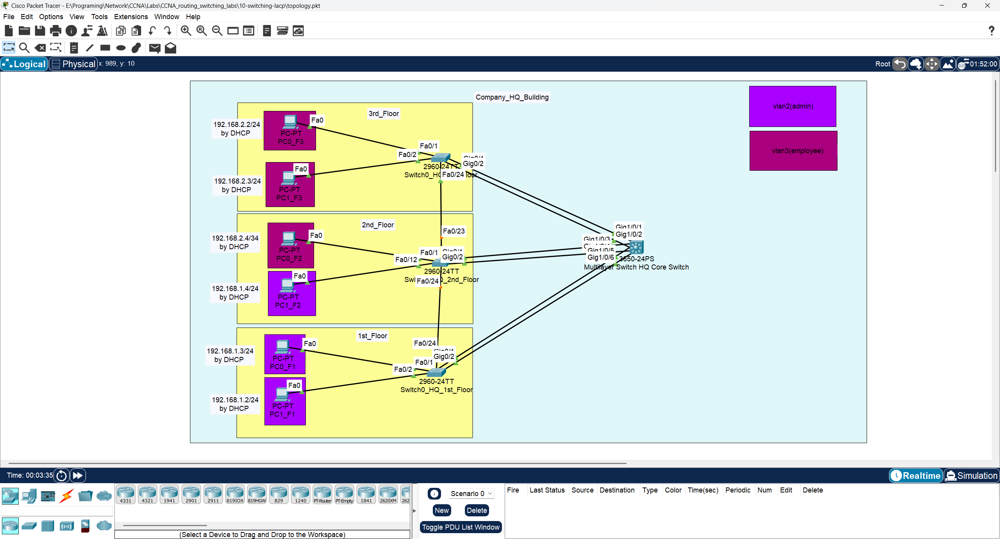
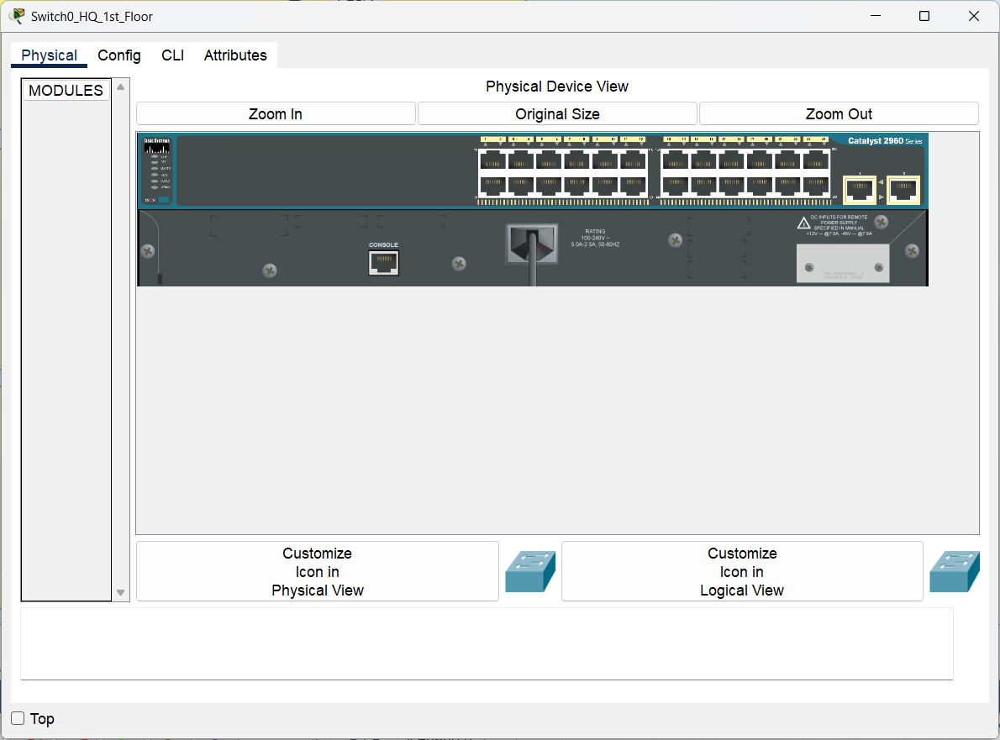

# 🖥️ CCNA Lab 10: Configuring LACP EtherChannel

## 📌 Objective

The purpose of this lab is to configure **EtherChannel** using **Link Aggregation Control Protocol (LACP)** to bundle multiple physical switch ports into a single logical link. This lab demonstrates how to increase bandwidth and provide redundancy between switches, building upon the stable, segmented network created in the previous STP and VLAN labs.

### Key Tasks

1.  Identify redundant links between the core and access switches that were previously blocked by STP.
2.  Configure **LACP EtherChannel** groups on the core multilayer switch and the three access layer switches.
3.  Bundle pairs of Gigabit Ethernet interfaces into logical **Port-Channel** interfaces.
4.  Configure the logical Port-Channel interfaces as **802.1Q trunks** to carry traffic for all VLANs.
5.  Verify the status of the EtherChannel links to ensure they are properly bundled and functioning.

---

## 🔗 Prerequisite Labs

This lab builds directly on the configurations from **Lab 08 (STP)** and **Lab 09 (VLANs)**. The initial setup (hostnames, STP root bridge, VTP, VLANs, and Inter-VLAN routing) is assumed to be in place.

*   ➡️ **[Lab 08: Configuring Spanning Tree Protocol (STP)](../08-switching-stp/README.md)**
*   ➡️ **[Lab 09: Configuring VLANs and Inter-VLAN Routing](../09-switching-vlan/README.md)**

---

## 🗂️ Topology

The lab uses the same topology, where redundant links between the core and access switches will be bundled into EtherChannels.



---

### 🧱 Physical Hardware

This lab uses one **Cisco 3650-24PS** as the core switch and three **Cisco 2960-24TT** switches as access switches.

| Multilayer Core Switch (HQ) | Access Switches (Per Floor) |
| :---: | :---: |
|  |  |

---

## ▶️ Run the Lab

You can open and run this topology directly in **Cisco Packet Tracer**:

*   **File:** [`topology.pkt`](./topology.pkt)
*   **Software Required:** Cisco Packet Tracer **v8.x or later**

---

## ⚙️ Configuration Steps

This lab focuses on configuring LACP to bundle the redundant uplinks between the core switch and each access switch.

➡️ Refer to [`configs/commands.txt`](./configs/commands.txt) for the complete list of commands for all devices.

---

### Part 1: Configure LACP on Physical Interfaces

On both the core switch and the access switches, you need to assign the physical interfaces to a channel group. We will use `mode active` to actively initiate LACP negotiations.

**Core Switch (Example for links to `switch0_HQ_F3`):**

```bash
interface range GigabitEthernet1/0/1 - 2
 channel-group 1 mode active
```

**Access Switch (Example on `switch0_HQ_F3`):**

```bash
interface range GigabitEthernet0/1 - 2
 channel-group 1 mode active
```

*Note: The channel-group number is locally significant, but it's good practice to keep them consistent. The LACP mode (`active`/`passive`) must be compatible on both ends.*

---

### Part 2: Configure the Logical Port-Channel Interface

Once a channel group is created, a logical `Port-channel` interface is automatically created. This is the interface you must now configure. All configuration applied to the Port-Channel will be inherited by the member physical interfaces.

**Core Switch (Example for `Port-channel1`):**

```bash
interface Port-channel1
 switchport mode trunk
```

**Access Switch (Example on `switch0_HQ_F3`):**

```bash
interface Port-channel1
 switchport mode trunk
```

---

## 🔍 Verification

The primary command to verify EtherChannel is `show etherchannel summary`.

### From STP to LACP: A Comparison

In **Lab 08**, Spanning Tree Protocol prevented loops by blocking one of the two redundant links between each access switch and the core switch. This meant we had 2 Gbps of physical connectivity, but only 1 Gbps was being used.

With **LACP EtherChannel**, we can bundle these two links into a single logical channel. This provides two key benefits:
1.  **Increased Bandwidth:** The logical link now has a total bandwidth of 2 Gbps, as traffic can be load-balanced across both physical links.
2.  **High Availability:** If one physical link in the bundle fails, traffic will automatically and seamlessly continue to flow over the remaining link without any STP reconvergence.

---

## ✅ Expected Output

### Core Switch (`show etherchannel summary`)

The output should show three EtherChannel groups (Po1, Po2, Po3), each using the LACP protocol, and each with two bundled ports (P).

```
Flags:  D - down        P - bundled in port-channel
        I - stand-alone s - suspended
        H - Hot-standby (LACP only)
        R - Layer3      S - Layer2
        U - in use      f - failed to allocate aggregator

        M - not in use, minimum links not met
        u - unsuitable for bundling
        w - waiting to be aggregated
        d - default port


Number of channel-groups in use: 3
Number of aggregators:           3

Group  Port-channel  Protocol    Ports
------+-------------+-----------+-----------------------------------------------
1      Po1(SU)       LACP        Gi1/0/1(P)  Gi1/0/2(P)
2      Po2(SU)       LACP        Gi1/0/3(P)  Gi1/0/4(P)
3      Po3(SU)       LACP        Gi1/0/5(P)  Gi1/0/6(P)
```

### Access Switch (`show etherchannel summary` on `switch0_HQ_F1`)

The output will show a single EtherChannel group connecting it to the core switch.

```
Flags:  D - down        P - bundled in port-channel
        I - stand-alone s - suspended
        H - Hot-standby (LACP only)
        R - Layer3      S - Layer2
        U - in use      f - failed to allocate aggregator

        M - not in use, minimum links not met
        u - unsuitable for bundling
        w - waiting to be aggregated
        d - default port


Number of channel-groups in use: 1
Number of aggregators:           1

Group  Port-channel  Protocol    Ports
------+-------------+-----------+-----------------------------------------------
3      Po3(SU)       LACP        GigabitEthernet0/1(P) GigabitEthernet0/2(P)
```

---

## 📂 Repository Structure

```
10-switching-lacp/
├── README.md               # Lab instructions & documentation
├── topology.pkt            # Packet Tracer file
├── configs/
│   └── commands.txt        # All CLI commands used in this lab
└── diagrams/
    ├── physical_show_of_access_switch2960-24TT_in_each_floor_in_company_hq.png
    ├── physical_show_of_multilayer_core_switch3650-24ps_company_hq.png
    └── topology.png
```

---

## 🎯 Learning Outcomes

By completing this lab, you have learned to:

*   Explain the benefits of EtherChannel for bandwidth aggregation and redundancy.
*   Configure Layer 2 EtherChannel using the LACP standard.
*   Bundle physical interfaces into a logical Port-Channel interface.
*   Configure a Port-Channel interface as a trunk.
*   Verify the operational status of an LACP EtherChannel.
