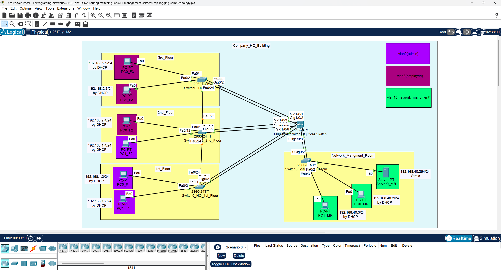
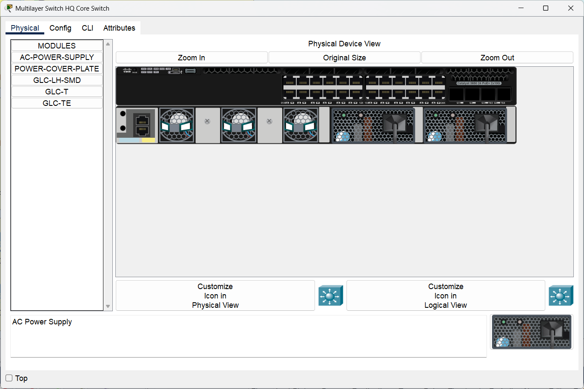
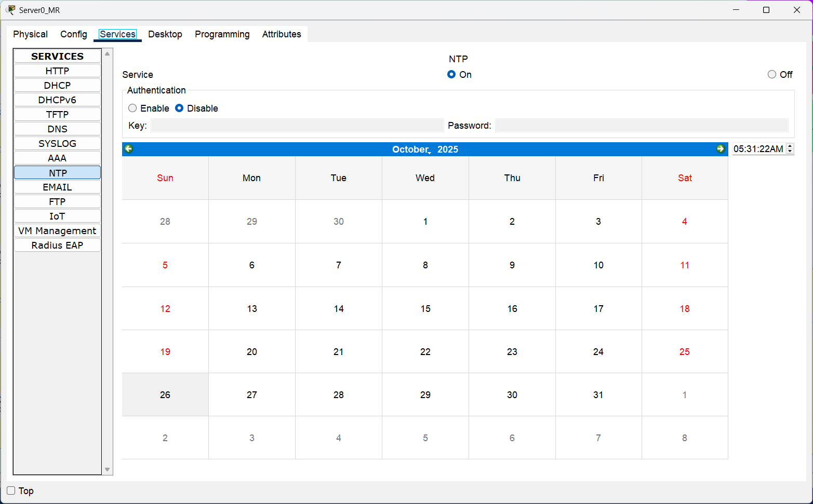
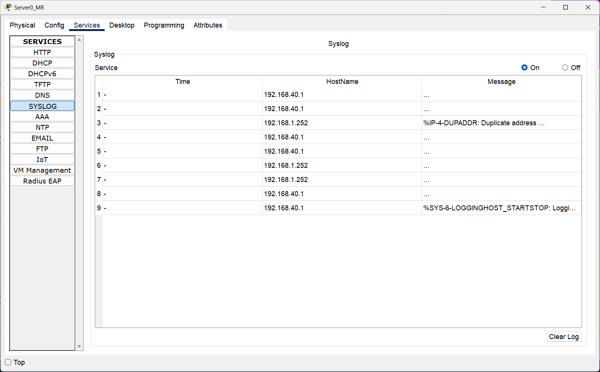
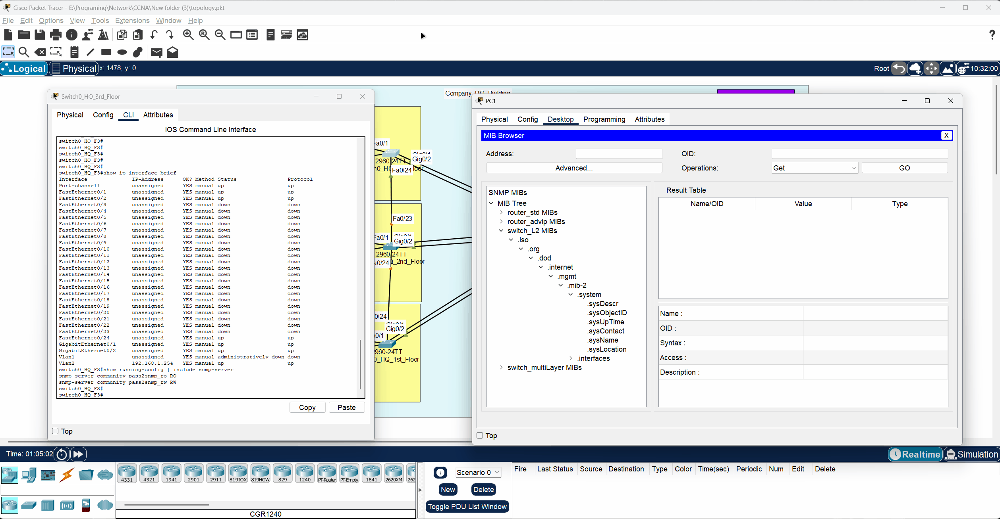

# 🖥️ CCNA Lab 11: Configuring Management Services (NTP, Logging, and SNMP)

## 📌 Objective

The purpose of this lab is to configure essential network management services to monitor, manage, and troubleshoot the network infrastructure. This lab covers the configuration of a dedicated **management VLAN**, Network Time Protocol (**NTP**) for time synchronization, **Syslog** for centralized logging, and Simple Network Management Protocol (**SNMP**) for network monitoring and management.

### Key Tasks

1.  Create a dedicated **management VLAN** and subnet for network devices and servers.
2.  Configure a new access switch for the management room.
3.  Configure all switches to synchronize their clocks with a central **NTP server**.
4.  Configure all switches to send log messages to a central **Syslog server**.
5.  Enable **SNMP** on all switches with read-only and read-write community strings for secure network monitoring.
6.  Verify that all management services are functioning correctly.

---

## 🔗 Prerequisite Labs

This lab is step in building a complete enterprise network and builds directly on the configurations from the previous labs. The initial setup (STP, VLANs, Inter-VLAN routing, and LACP) is assumed to be in place.

*   ➡️ **[Lab 08: Configuring Spanning Tree Protocol (STP)](../08-switching-stp/README.md)**
*   ➡️ **[Lab 09: Configuring VLANs and Inter-VLAN Routing](../09-switching-vlan/README.md)**
*   ➡️ **[Lab 10: Configuring LACP EtherChannel](../10-switching-lacp/README.md)**

---

## 🗂️ Topology

The lab uses the established topology and adds a dedicated management network segment. This includes a new switch (`switch0_HQ_MR1`) in the Management Room, which connects to two servers: an NTP Server and a Logging/SNMP Server.



---

### 🧱 Physical Hardware

This lab uses one **Cisco 3650-24PS** as the core switch and four **Cisco 2960-24TT** switches as access switches.

| Multilayer Core Switch (HQ) | Access Switches (Per Floor) |
| :---: | :---: |
|  |  |

---

## ▶️ Run the Lab

You can open and run this topology directly in **Cisco Packet Tracer**:

*   **File:** [`topology.pkt`](./topology.pkt)
*   **Software Required:** Cisco Packet Tracer **v8.x or later**

---

## ⚙️ Configuration Steps

This lab is divided into four main parts:

1.  **Management VLAN and DHCP Configuration**
2.  **New Management Switch Configuration**
3.  **NTP and Logging Configuration**
4.  **SNMP Configuration**

➡️ Refer to [`configs/commands.txt`](./configs/commands.txt) for the complete list of commands for all devices.

---

### Part 1: Configure Management VLAN (Core Switch)

Create a new VLAN for management traffic, configure its SVI to act as the default gateway, and set up a DHCP pool.

**Core Switch:**

```bash
! Create the Management VLAN
vlan 10
 name Management
exit

! Configure the SVI for Inter-VLAN routing
interface Vlan10
 ip address 192.168.40.1 255.255.255.0
 no shutdown
exit

! Configure DHCP for the Management VLAN
ip dhcp excluded-address 192.168.40.1
ip dhcp excluded-address 192.168.40.254
!
ip dhcp pool VLAN10_MANAGEMENT_HQ
 network 192.168.40.0 255.255.255.0
 default-router 192.168.40.1
exit
```

---

### Part 2: Configure the New Management Switch

Configure the new switch (`switch0_HQ_MR1`) to connect to the core, assign its access ports to the management VLAN, and set up its own management IP.

**Management Room Switch (`switch0_HQ_MR1`):**

```bash
! Configure VTP
vtp mode client
vtp domain HQ

! Create LACP EtherChannel to Core Switch
interface range GigabitEthernet0/1 - 2
 channel-group 4 mode active
 no shutdown
exit

! Configure the Port-Channel as a trunk
interface Port-channel4
 switchport mode trunk
exit

! Assign access ports to the Management VLAN
interface range FastEthernet0/1 - 24
 switchport mode access
 switchport access vlan 10
 spanning-tree portfast
 spanning-tree bpduguard enable
exit
```

---

### Part 3: Configure NTP and Logging

Configure all switches to point to the central NTP and Syslog servers using their IP addresses.

**All Switches (Example on `core-switch0-HQ`):**

```bash
! Set the NTP server address
ntp server 192.168.40.254

! Set the Syslog server address
logging 192.168.40.254
```

---

### Part 4: Configure SNMP

Enable SNMP on all switches by configuring read-only (RO) and read-write (RW) community strings.

**All Switches (Example on `switch0_HQ_F1`):**

```bash
! Configure a read-only community string
snmp-server community pass2snmp_ro RO

! Configure a read-write community string
snmp-server community pass2snmp_rw RW
```

---

## 🔍 Verification

You can verify each service using `show` commands on the switches and by observing the servers.

### 1. Verify NTP Synchronization

Use the `show ntp status` command on any switch to confirm it is synchronized with the NTP server. On the server itself, you can verify that the time service is enabled and running.

```bash
show ntp status
```



### 2. Verify Logging

Check the Syslog server's GUI to see log messages appearing from the network devices.



### 3. Verify SNMP

Use an SNMP tool like a MIB Browser to query (GET) and modify (SET) device parameters, such as the hostname.



---

## ✅ Expected Output

### Core Switch (`show ntp status`)

The output should indicate that the clock is synchronized.

```
core-switch0-HQ#show ntp status
Clock is synchronized, stratum 16, reference is 192.168.40.254
nominal freq is 250.0000 Hz, actual freq is 249.9990 Hz, precision is 2**24
```

### Any Switch (`show running-config | include snmp`)

The output should display the configured SNMP community strings.

```
switch0_HQ_F1#show running-config | include snmp-server
snmp-server community pass2snmp_rw RW
snmp-server community pass2snmp_ro RO
```

---

## 📂 Repository Structure

```
11-management-services-ntp-logging-snmp/
├── README.md               # Lab instructions & documentation
├── topology.pkt            # Packet Tracer file
├── configs/
│   └── commands.txt        # All CLI commands used in this lab
└── diagrams/
    ├── logging_server_view.png
    ├── ntp_server_view.png
    ├── physical_show_of_access_switch2960-24TT_in_each_floor_in_company_hq.png
    ├── physical_show_of_multilayer_core_switch3650-24ps_company_hq.png
    ├── test_snmp_with_mib_browser_to_get_and_change_switch_name.gif
    └── topology.png
```

---

## 🎯 Learning Outcomes

By completing this lab, you have learned to:

*   Design and implement a dedicated management VLAN for network devices.
*   Configure NTP to ensure consistent time across all network devices.
*   Implement centralized Syslog to aggregate network device logs for easier monitoring.
*   Configure SNMP to allow for remote management and monitoring of network devices.
*   Verify the operational state of key network management protocols.
