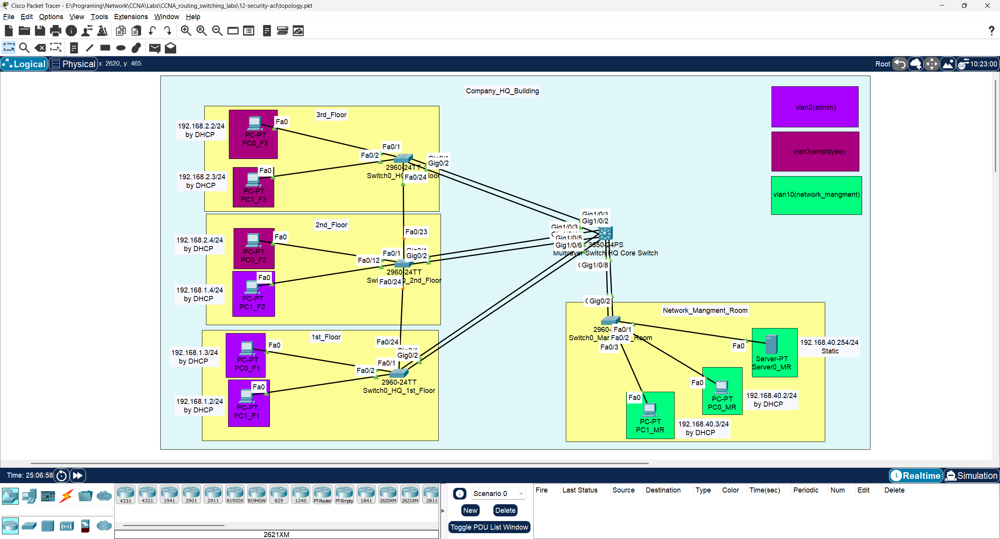
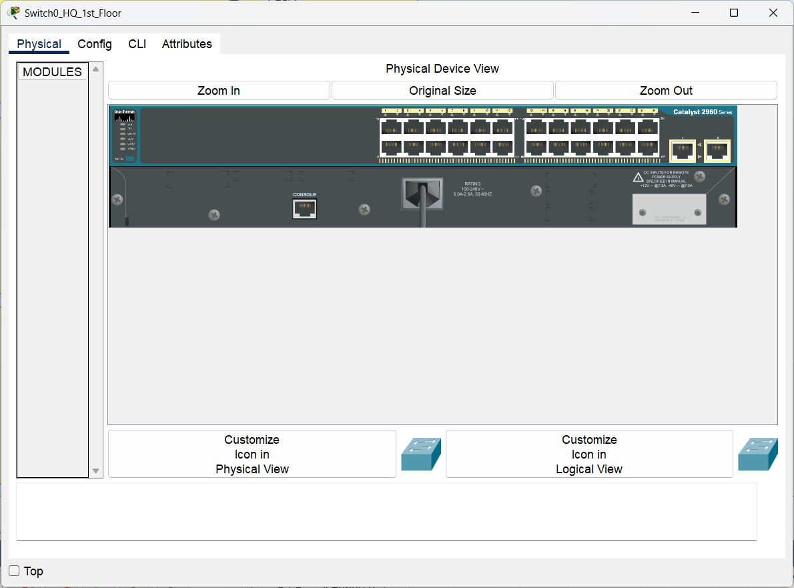
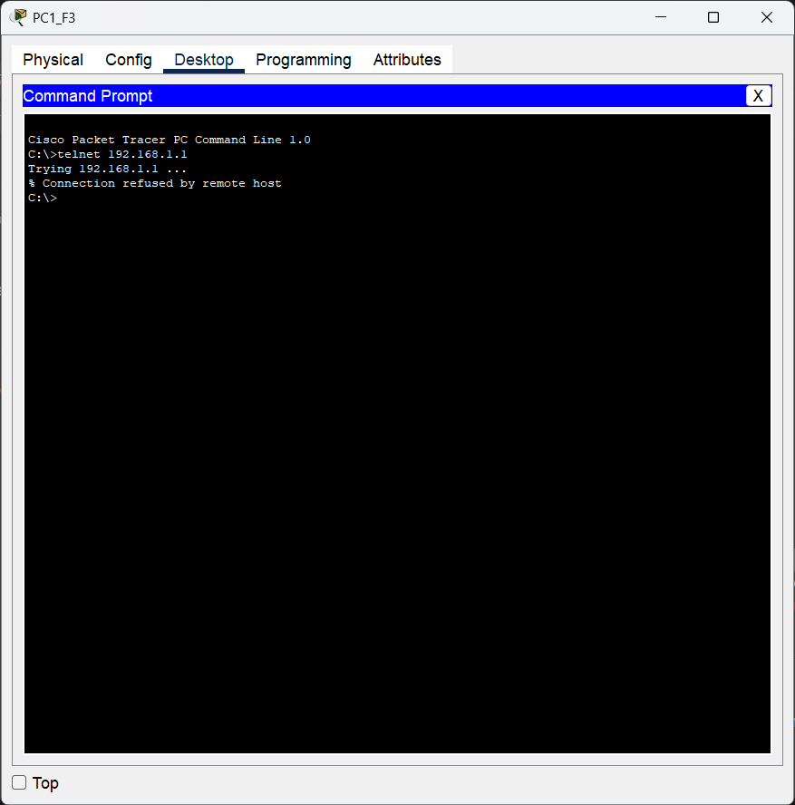
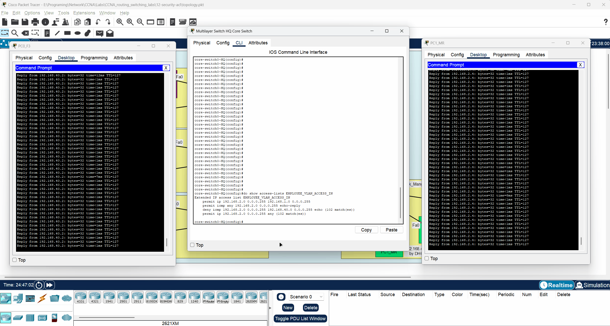

# 🖥️ CCNA Lab 12: Configuring Security with Access Control Lists (ACLs)

## 📌 Objective

The purpose of this lab is to implement network security policies using **Access Control Lists (ACLs)**. This lab covers the configuration of **Standard ACLs** to secure administrative access to network devices and **Extended ACLs** to filter traffic and control communication between different VLANs, thereby enforcing specific security requirements in the network.

### Key Tasks

1.  Secure VTY (Telnet/SSH) lines on all switches to only permit access from the dedicated management network.
2.  Create a **Standard ACL** that identifies the management subnet as the only authorized source for remote access.
3.  Apply the Standard ACL to the VTY lines on all switches.
4.  Implement a more granular traffic policy using an **Extended ACL** on the core multilayer switch.
5.  Configure the Extended ACL to control inter-VLAN traffic, specifically how the 'employee' VLAN can interact with other network segments.
6.  Apply the Extended ACL to the appropriate Switched Virtual Interface (SVI).
7.  Verify that the security policies are correctly enforced.

---

## 🔗 Prerequisite Labs

This lab is the final step in building a complete enterprise network and directly builds upon the configurations from previous labs. The foundational setup (STP, VLANs, Inter-VLAN routing, LACP, and Management Services) is assumed to be fully operational.

*   ➡️ **[Lab 08: Configuring Spanning Tree Protocol (STP)](../08-switching-stp/README.md)**
*   ➡️ **[Lab 09: Configuring VLANs and Inter-VLAN Routing](../09-switching-vlan/README.md)**
*   ➡️ **[Lab 10: Configuring LACP EtherChannel](../10-switching-lacp/README.md)**
*   ➡️ **[Lab 11: Configuring Management Services (NTP, Logging, and SNMP)](../11-management-services-ntp-logging-snmp/README.md)**

---

## 🗂️ Topology

The lab uses the same comprehensive topology established in the previous labs, featuring a core switch, access switches for three floors, and a dedicated management room switch. ACLs will be applied to this existing infrastructure to enforce security policies.



---

### 🧱 Physical Hardware

This lab utilizes one **Cisco 3650-24PS** as the core switch and four **Cisco 2960-24TT** switches as access switches.

| Multilayer Core Switch (HQ) | Access Switches (Per Floor) |
| :---: | :---: |
|  |  |

---

## ▶️ Run the Lab

You can open and run this topology directly in **Cisco Packet Tracer**:

*   **File:** [`topology.pkt`](./topology.pkt)
*   **Software Required:** Cisco Packet Tracer **v8.x or later**

---

## ⚙️ Configuration Steps

This lab is divided into two main parts: securing device management access and controlling inter-VLAN traffic.

➡️ Refer to [`configs/commands.txt`](./configs/commands.txt) for the complete list of commands for all devices.

---

### Part 1: Configure Standard ACL for VTY Access

A **Standard ACL** is used to filter traffic based only on the source IP address. This makes it efficient for tasks like restricting management access. We will create a named ACL called `VTY_ACCESS` that permits only the management network (`192.168.40.0/24`) and apply it to the VTY lines of all switches to block Telnet/SSH attempts from any other network.

**All Switches (Example on `core-switch0-HQ`):**

```bash
! Create a standard access-list to permit the management network
ip access-list standard VTY_ACCESS
 permit 192.168.40.0 0.0.0.255
!
! Apply the access-list to the VTY lines
line vty 0 4
 access-class VTY_ACCESS in
```

---

### Part 2: Configure Extended ACL for Inter-VLAN Policy

**Extended ACLs** provide more granular control, allowing you to filter based on source and destination IP addresses, protocol type, and port numbers. We will create an Extended ACL on the core switch to enforce the following policy for the Employee VLAN (VLAN 3):
1.  **Permit** all traffic from employees (`192.168.2.0/24`) to the admin network (`192.168.1.0/24`).
2.  **Deny** employees from pinging (ICMP echo) the management network (`192.168.40.0/24`) for security reasons.
3.  **Permit** all other traffic from employees to any other destination.

This ACL is applied inbound on the `Vlan3` SVI, filtering traffic as it enters the routing process from the Employee VLAN.

**Core Switch (`core-switch0-HQ`):**

```bash
! Create the extended access-list
ip access-list extended EMPLOYEE_VLAN_ACCESS_IN
 ! 1. Allow employees to access the admin network
 permit ip 192.168.2.0 0.0.0.255 192.168.1.0 0.0.0.255
 ! 2. Deny pings from employees to the management network
 deny   icmp 192.168.2.0 0.0.0.255 192.168.40.0 0.0.0.255 echo
 ! 3. Allow all other traffic from employees
 permit ip 192.168.2.0 0.0.0.255 any
! Note: An implicit "deny any any" is at the end of every ACL.

! Apply the ACL to the SVI for VLAN 3
interface Vlan3
 ip access-group EMPLOYEE_VLAN_ACCESS_IN in
```

---

## 🔍 Verification

After configuration, you must test the ACLs to ensure they are working as intended.

### 1. Verify VTY Access (Standard ACL)

-   **From Management PC:** Attempt to Telnet to any switch. The connection should be **successful**.
-   **From Admin or Employee PC:** Attempt to Telnet to any switch. The connection should be **refused**.

| From Management PC | From Admin PC | From Employee PC |
| :---: | :---: | :---: |
|  |  |  |


### 2. Verify Inter-VLAN Policy (Extended ACL)

-   **From an Employee or Admin PC:** Ping a device in the Management VLAN (e.g., 192.168.40.2). The ping should **fail**.
-   **From an Management PC:** Ping a device in the Employee or Admin VLAN (e.g., 192.168.2.4). The ping should **successful**.

This behavior demonstrates the Extended ACL correctly filtering traffic based on protocol and destination.



---

## ✅ Expected Output

### Core Switch (`show access-lists`)

The output on the core switch should display both the Standard and Extended ACLs that you have configured.

```
core-switch0-HQ#show access-lists
Standard IP access list VTY_ACCESS
    10 permit 192.168.40.0, wildcard bits 0.0.0.255
Extended IP access list EMPLOYEE_VLAN_ACCESS_IN
    10 permit ip 192.168.2.0 0.0.0.255 192.168.1.0 0.0.0.255
    20 deny icmp 192.168.2.0 0.0.0.255 192.168.40.0 0.0.0.255 echo
    30 permit ip 192.168.2.0 0.0.0.255 any
```

---

## 📂 Repository Structure

```
12-security-acl/
├── README.md               # Lab instructions & documentation
├── topology.pkt            # Packet Tracer file
├── configs/
│   └── commands.txt        # All CLI commands used in this lab
└── diagrams/
    ├── physical_show_of_access_switch2960-24TT_in_each_floor_in_company_hq.png
    ├── physical_show_of_multilayer_core_switch3650-24ps_company_hq.png
    ├── ping_behvier_between_employee_pc_network_mangment_pc_after_and_before_extended_acl.gif
    ├── test_telnet_from_admin_pc.png
    ├── test_telnet_from_employee_pc.png
    ├── test_telnet_from_management_pc.png
    └── topology.png
```

---

## 🎯 Learning Outcomes

By completing this lab, you have learned to:

*   Differentiate between Standard and Extended Access Control Lists.
*   Implement a Standard ACL to secure remote administrative access (VTY).
*   Use the `access-class` command to apply an ACL to VTY lines.
*   Implement an Extended ACL to create granular, policy-based traffic filtering rules.
*   Apply an ACL to a Switched Virtual Interface (SVI) to control inter-VLAN routing.
*   Verify ACL functionality using `ping` and `telnet`.
*   Interpret the output of `show access-lists`.
