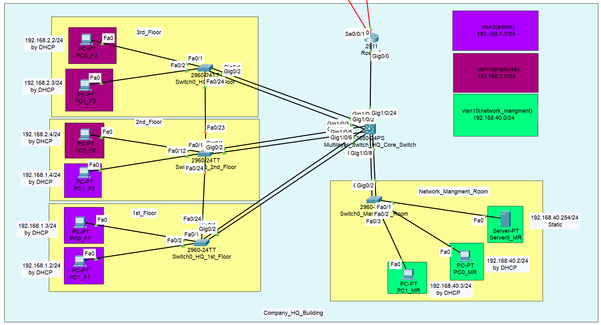
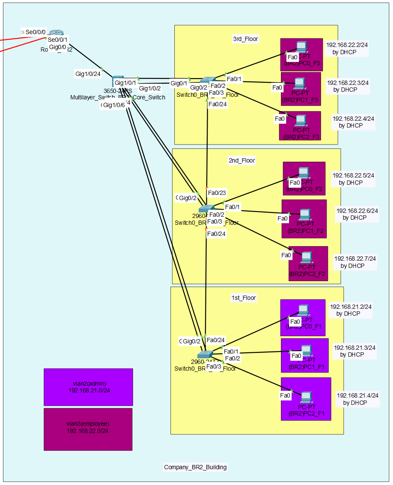
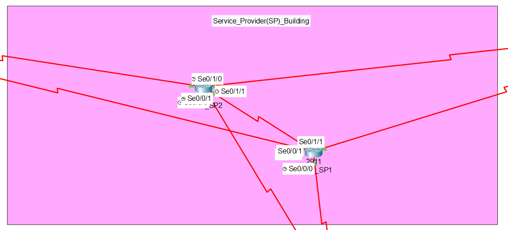
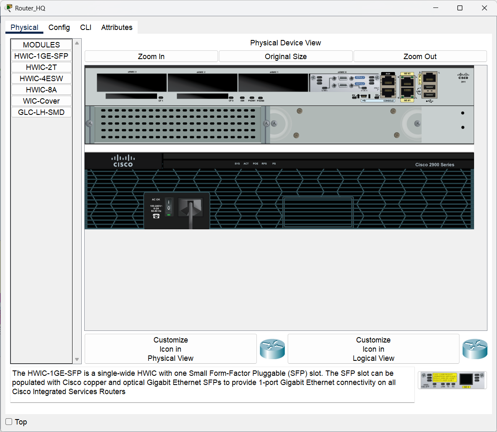
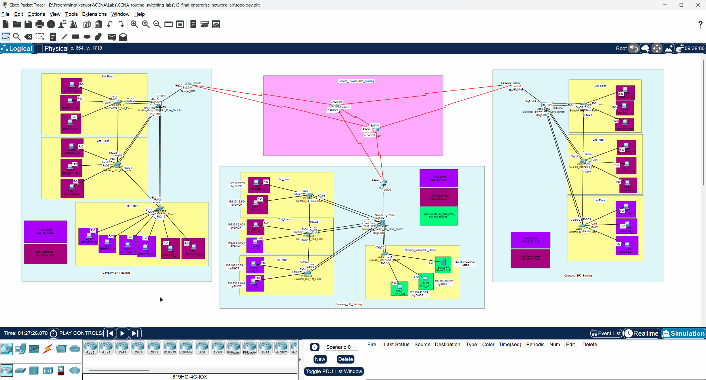

# 🖥️ CCNA Lab 13: Final Enterprise Network Lab

## 📌 Objective

The purpose of this capstone lab is to **design, build, and verify a comprehensive enterprise network** that integrates all the core routing, switching, security, and management concepts covered in the previous CCNA labs. This final project simulates a realistic corporate network with a central headquarters (HQ) and two remote branch offices (BR1 and BR2), all interconnected via a service provider (SP) backbone.

### Key Tasks

1.  **Build a multi-site WAN** using OSPF as the dynamic routing protocol.
2.  **Implement a hierarchical switched LAN architecture** at each site, including a core multilayer switch and access layer switches.
3.  **Integrate advanced switching technologies**, such as VLANs for network segmentation, STP for loop prevention, and LACP EtherChannel for link redundancy and aggregation.
4.  **Configure Inter-VLAN routing** and DHCP services on the core switch at each site.
5.  **Secure the network** using Access Control Lists (ACLs) to filter traffic between VLANs and restrict remote management access.
6.  **Deploy essential network management services**, including NTP for time synchronization, Syslog for centralized logging, and SNMP for monitoring.
7.  **Verify end-to-end connectivity** across the entire enterprise, ensuring devices in any site can communicate with devices in any other site according to the security policy.

---

## 🔗 Prerequisite Labs

This final lab is the culmination of all previous labs. It assumes a thorough understanding of the concepts and configurations from the following modules:

*   ➡️ **[Lab 07: OSPF Routing](../07-ospf-routing/README.md)**
*   ➡️ **[Lab 08: Switching - STP](../08-switching-stp/README.md)**
*   ➡️ **[Lab 09: Switching - VLANs & Inter-VLAN Routing](../09-switching-vlan/README.md)**
*   ➡️ **[Lab 10: Switching - LACP EtherChannel](../10-switching-lacp/README.md)**
*   ➡️ **[Lab 11: Management Services (NTP, Logging, SNMP)](../11-management-services-ntp-logging-snmp/README.md)**
*   ➡️ **[Lab 12: Security - ACLs](../12-security-acl/README.md)**

---

## 🗂️ Topology

The enterprise network consists of three main sites connected through a simulated Service Provider network running OSPF.

*   **Headquarters (HQ):** The central site with a full three-tier switched network, a dedicated management VLAN, and connections to the SP network.
*   **Branch 1 (BR1) & Branch 2 (BR2):** Two remote offices, each with a similar, smaller-scale switched LAN architecture.
*   **Service Provider (SP):** A two-router backbone that provides the WAN connectivity between all sites.

### Overall Enterprise Topology


### Site-Specific Topologies

| Headquarters (HQ) Topology | Branch 1 (BR1) Topology | Branch 2 (BR2) Topology | Service Provider (SP) Topology |
| :---: | :---: | :---: | :---: |
|  |  |  |  |

### 🧱 Physical Hardware

This lab utilizes several models of Cisco devices to build the enterprise network.

| Edge Routers (HQ, Branches, SP) | Core Switches (HQ & Branches) | Access Switches (HQ & Branches) |
| :---: | :---: | :---: |
|  |  |  |

---

## ▶️ Run the Lab

You can open and run this complete enterprise topology directly in **Cisco Packet Tracer**:

*   **File:** [`topology.pkt`](./topology.pkt)
*   **Software Required:** Cisco Packet Tracer **v8.x or later**

---

## ⚙️ Configuration Steps

The configuration is broken down by site. Each site reuses and integrates technologies from the prerequisite labs. For the complete command list for each site, refer to the `configs` directory.

➡️ **HQ Commands:** [`configs/hq_commands.txt`](./configs/hq_commands.txt)
➡️ **Branch 1 Commands:** [`configs/br1_commands.txt`](./configs/br1_commands.txt)
➡️ **Branch 2 Commands:** [`configs/br2_commands.txt`](./configs/br2_commands.txt)
➡️ **Service Provider Commands:** [`configs/sp_commands.txt`](./configs/sp_commands.txt)

---

### Part 1: Service Provider Network Configuration

The SP network is configured with basic OSPF to provide routing between the HQ and branch offices.

**Example – OSPF on `Router0_SP`:**

```bash
router ospf 1
 router-id 5.5.5.5
 network 10.0.0.0 0.255.255.255 area 0
```

---

### Part 2: Headquarters (HQ) Network Configuration

The HQ network is the most complex, integrating all previously covered topics.

*   **Switching (Labs 08-10):** STP, VTP, VLANs, Inter-VLAN Routing, and LACP EtherChannel are configured on the core and access switches.
*   **Routing (Lab 07):** The core multilayer switch and the edge router run OSPF to exchange routes with the LAN and the SP network, respectively.
*   **Management (Lab 11):** NTP, Syslog, and SNMP are configured on all manageable devices, pointing to the servers in the dedicated Management VLAN.
*   **Security (Lab 12):** ACLs are applied to restrict VTY access and to filter traffic between the employee and management VLANs.

**Example – OSPF on `core-switch0-HQ`:**

```bash
router ospf 1
 router-id 10.1.1.1
 network 192.168.1.0 0.0.0.255 area 0
 network 192.168.2.0 0.0.0.255 area 0
 network 192.168.40.0 0.0.0.255 area 0
 network 10.0.0.0 0.0.0.3 area 0
 passive-interface Vlan2
 passive-interface Vlan3
 passive-interface Vlan10
```

---

### Part 3: Branch Office (BR1 & BR2) Configuration

The branch offices are configured as smaller versions of the HQ. They include the same core technologies (VLANs, STP, LACP, OSPF, DHCP, etc.) but on a smaller scale. Each branch has its own VTP domain and IP subnets, and they learn routes to other sites via OSPF from the SP.

**Example – OSPF on `Router0_BR1`:**

```bash
router ospf 1
 router-id 2.2.2.2
 network 10.0.1.0 0.0.0.3 area 0
 network 10.20.1.0 0.0.0.3 area 0
 network 10.20.2.0 0.0.0.3 area 0
```

---

## 🔍 Verification

Verification focuses on end-to-end connectivity and the successful exchange of routing information.

### 1. Check Routing Tables

On the edge router of each site, use `show ip route` to confirm that it has learned the LAN subnets from all other sites via OSPF.

### 2. End-to-End Connectivity

*   A PC in Branch 1's employee VLAN should be able to ping a PC in Branch 2's employee VLAN.
*   A PC in HQ's admin VLAN should be able to ping a PC in Branch 1's admin VLAN.
*   A PC in any employee VLAN should **not** be able to ping a server in the HQ management VLAN (due to the ACL).

### 🛰️ Message Simulation

Use Packet Tracer's simulation mode to visualize traffic flowing from one branch, through the SP cloud, to another branch, or to the HQ.

| Simulation Between Branches | Simulation Between All Sites |
| :---: | :---: |
|  |  |

---

## ✅ Expected Output

### Routing Table on HQ Router (`show ip route` on `Router0_HQ`)

The routing table should contain OSPF-learned (`O`) routes to the LAN subnets of Branch 1 (192.168.11.0/24, 192.168.12.0/24) and Branch 2 (192.168.21.0/24, 192.168.22.0/24).

```
O    192.168.11.0/24 [110/65] via 10.10.1.2, 00:10:15, Serial0/0/0
O    192.168.12.0/24 [110/65] via 10.10.1.2, 00:10:15, Serial0/0/0
O    192.168.21.0/24 [110/65] via 10.10.1.2, 00:08:45, Serial0/0/0
O    192.168.22.0/24 [110/65] via 10.10.1.2, 00:08:45, Serial0/0/0
```

### OSPF Neighbors on Service Provider Router (`show ip ospf neighbor` on `Router0_SP`)

The SP router should show adjacencies with the routers from HQ, BR1, BR2, and its SP peer.

```
Neighbor ID     Pri   State           Dead Time   Address         Interface
1.1.1.1           1   FULL/BDR        00:00:35    10.10.1.1       Serial0/0/0
2.2.2.2           1   FULL/BDR        00:00:38    10.20.1.1       Serial0/1/0
3.3.3.3           1   FULL/BDR        00:00:31    10.30.1.1       Serial0/1/1
4.4.4.4           1   FULL/DR         00:00:33    10.100.100.2    Serial0/0/1
```

---

## 📂 Repository Structure

```
13-final-enterprise-network-lab
 ├── README.md
 ├── topology.pkt
 ├── configs
 │    ├── br1_commands.txt
 │    ├── br2_commands.txt
 │    ├── hq_commands.txt
 │    └── sp_commands.txt
 └── diagrams
      ├── branch_1_topology.png
      ├── branch_2_topology.png
      ├── enterprise_topology.png
      ├── hq_topology.png
      ├── messages_simulation_between_three_lans_two_branches_and_hq.gif
      ├── message_simulation_between_two_branches.gif
      ├── physical_show_of_access_switch2960-24TT_in_each_floor_in_company.png
      ├── physical_show_of_multilayer_core_switch3650-24ps_company.png
      ├── physical_show_of_Router_2911_in_hq_and_two_branches_and_sp.png
      └── sp_topology.png
```

---

## 🎯 Learning Outcomes

By completing this final lab, you have demonstrated the ability to:

*   Integrate multiple networking technologies into a functional, multi-site enterprise network.
*   Design and implement a scalable IP addressing scheme.
*   Configure and troubleshoot a complex OSPF routing domain.
*   Deploy a secure and redundant switched network infrastructure.
*   Apply security policies using ACLs to control traffic flow.
*   Implement a centralized network management and monitoring solution.
*   Perform comprehensive, end-to-end verification and troubleshooting across a wide area network.
