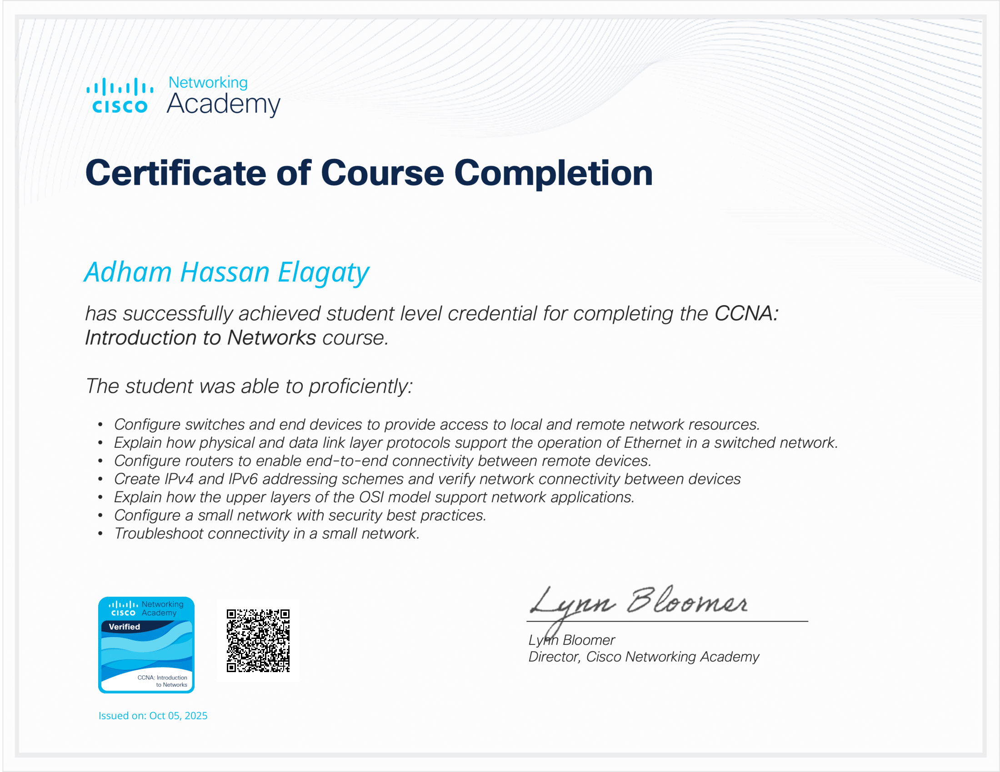
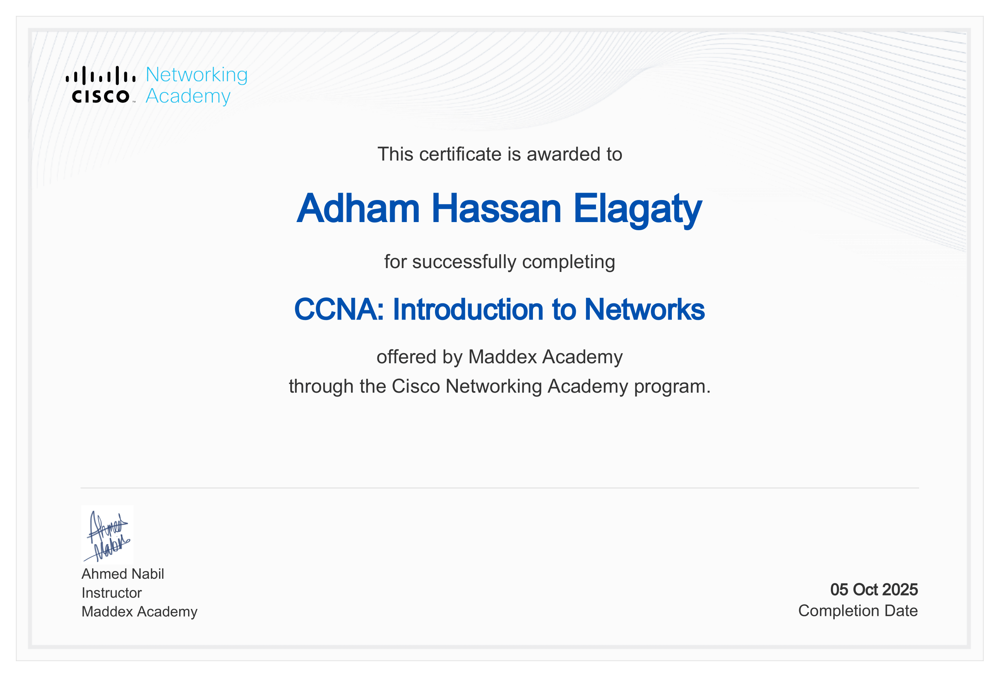
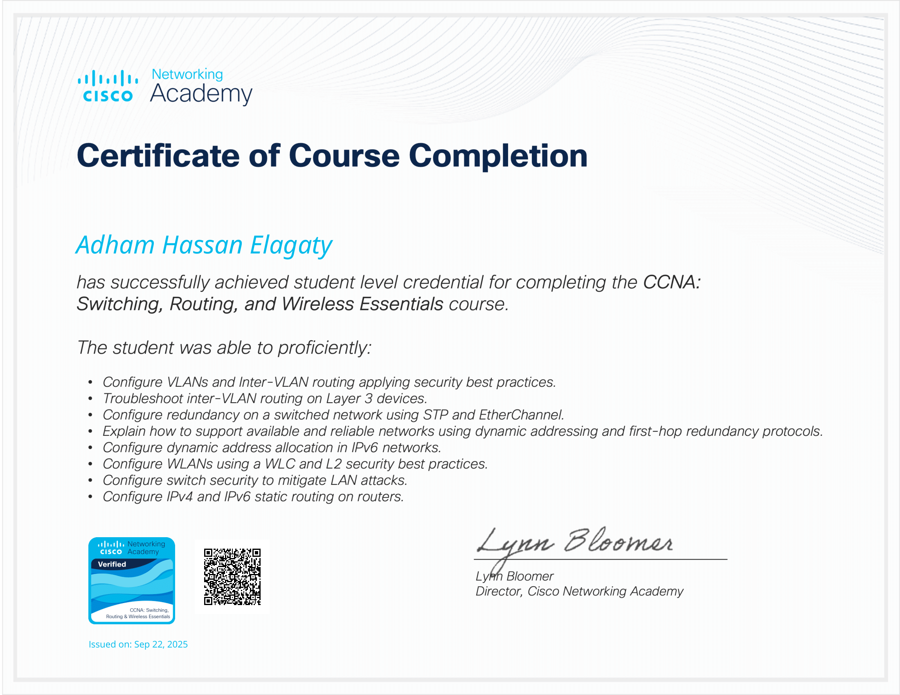
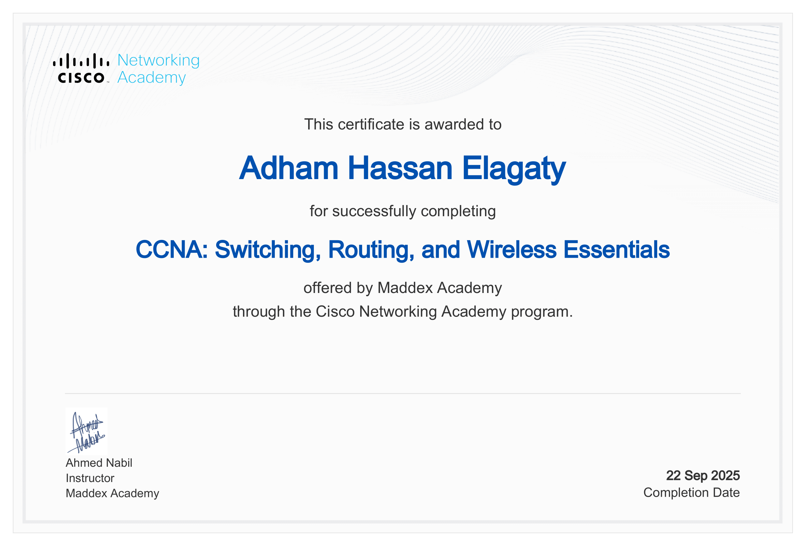
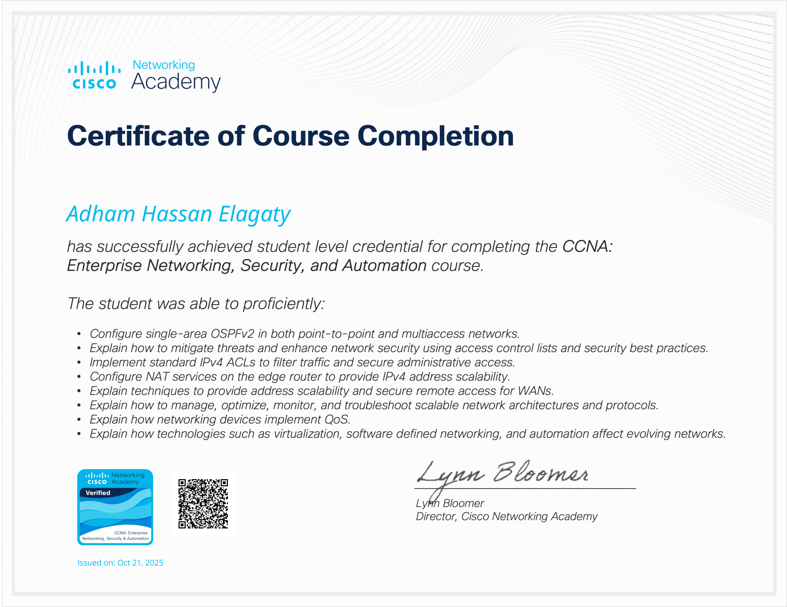
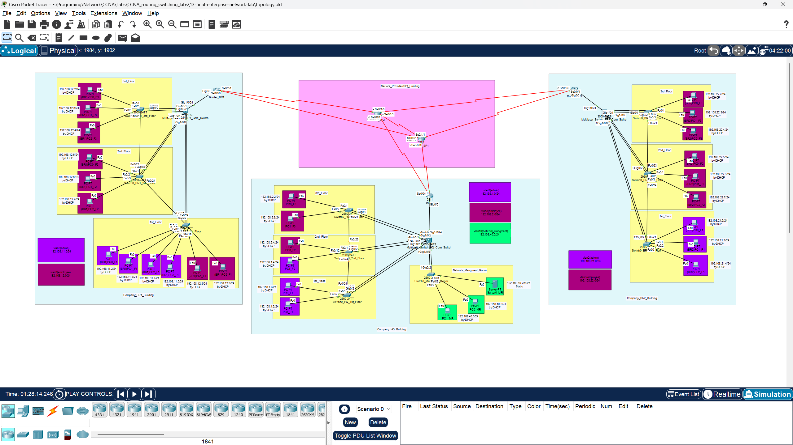

# 🚀 CCNA 200-301 Lab Journey: From Basics to a Full Enterprise Network

Welcome to my comprehensive repository of Cisco Packet Tracer labs, documenting my hands-on journey through the Cisco Certified Network Associate (CCNA) curriculum. This collection starts with fundamental concepts and progressively builds upon them, culminating in a final capstone project that integrates all learned skills into a realistic, multi-site enterprise network.

This repository serves as both a personal learning journal and a practical resource for anyone studying for the CCNA certification. Each lab is self-contained, with detailed instructions, configuration files, and verification steps.

## 🏅 Certifications & Course Completions

Below are the official Cisco Networking Academy courses I have completed. Click on each course title to expand the section and view the corresponding certificates and verifiable badge.

<strong>🎓 CCNA: Introduction to Networks</strong>

 

| Verifiable Badge (from Credly) |
| :---: |
|  |

| Cisco Credly Certificate | NetAcad Certificate |
| :---: | :---: |
|  |  |

<strong>🎓 CCNA: Switching, Routing, and Wireless Essentials</strong>

 

| Verifiable Badge (from Credly) |
| :---: |
|  |

| Cisco Credly Certificate | NetAcad Certificate |
| :---: | :---: |
|  |  |

<strong>🎓 CCNA: Enterprise Networking, Security, and Automation</strong>

 

| Verifiable Badge (from Credly) |
| :---: |
|  |

| Cisco Credly Certificate | NetAcad Certificate |
| :---: | :---: |
|  |  |

## 🛠️ Technologies and Skills Covered

This series of labs provides hands-on experience with a wide range of networking technologies, including:

*   **Routing:** Basic Router Configuration, Static Routing, and Dynamic Routing Protocols (RIP, EIGRP, OSPF).
*   **Switching:** VLANs, 802.1Q Trunking, Spanning Tree Protocol (STP), PortFast, BPDU Guard, and EtherChannel (LACP).
*   **IP Services:** DHCP Server Configuration, Network Time Protocol (NTP), and Syslog.
*   **Network Security:** Standard and Extended Access Control Lists (ACLs) for traffic filtering and securing VTY access.
*   **Network Management:** Simple Network Management Protocol (SNMP) for device monitoring.
*   **WAN Technologies:** Serial link configuration and multi-site connectivity.

## 🔬 Lab Series Overview

The repository is structured as a series of labs, each building on the last.

| Lab # | Lab Title & Link | Key Concepts Covered |
| :---: | :--- | :--- |
| **01** | [**Router Basic Configuration**](./01-router-basic-config/README.md) | Hostname, Privileged EXEC Password, Saving Configurations. |
| **02-03** | [**Router Interface & DHCP**](./02-03-router-interface-dhcp/README.md) | IP Address Assignment, Enabling Interfaces, DHCP Server Setup. |
| **04** | [**Static Routing**](./04-static-routing/README.md) | Connecting separate LANs using manually configured static routes. |
| **05-06**| [**Dynamic Routing (RIP & EIGRP)**](./05-06-dynamic-routing-rip-eigrp/README.md) | RIPv2, EIGRP, Administrative Distance, Automatic Network Discovery. |
| **07** | [**OSPF Routing**](./07-ospf-routing/README.md) | Single-Area OSPF, Link-State Routing, OSPF Neighbor Adjacencies. |
| **08** | [**Switching - Spanning Tree Protocol (STP)**](./08-switching-stp/README.md) | Loop Prevention, Root Bridge Election, PortFast, BPDU Guard. |
| **09** | [**Switching - VLANs & Inter-VLAN Routing**](./09-switching-vlan/README.md) | VLAN Creation, VTP, 802.1Q Trunking, SVIs, "Router-on-a-Stick". |
| **10** | [**Switching - LACP EtherChannel**](./10-switching-lacp/README.md) | Link Aggregation, Redundancy, Increased Bandwidth with LACP. |
| **11** | [**Management Services (NTP, Logging, SNMP)**](./11-management-services-ntp-logging-snmp/README.md) | Time Sync, Centralized Logging, Network Monitoring. |
| **12** | [**Security with Access Control Lists (ACLs)**](./12-security-acl/README.md) | Standard & Extended ACLs, Traffic Filtering, VTY line security. |
| **13** | [**Final Enterprise Network Lab**](./13-final-enterprise-network-lab/README.md) | **(Capstone)** Integration of all previous concepts into a multi-site network. |

## 🏆 The Capstone Project: Lab 13 - Final Enterprise Network

The final lab is a culmination of all the skills acquired. It involves building a complete enterprise network featuring a central headquarters, two remote branch offices, and a service provider backbone. This project integrates routing, switching, security, and management services into a single, cohesive, and functional network.

## 💻 Software Requirements

All labs were designed and tested using **Cisco Packet Tracer (v8.x or later)**.

## 📖 How to Use This Repository

1.  **Navigate to a Lab Folder:** Each numbered folder represents a self-contained lab.
2.  **Read the Instructions:** The `README.md` file inside each folder provides a detailed objective, topology diagram, configuration steps, and verification commands.
3.  **Run the Lab:** Open the `.pkt` file in Cisco Packet Tracer to interact with the pre-built topology.
4.  **Reference the Commands:** The `configs/commands.txt` file in each lab folder contains a complete, ready-to-use script of all the configurations applied to the devices.
